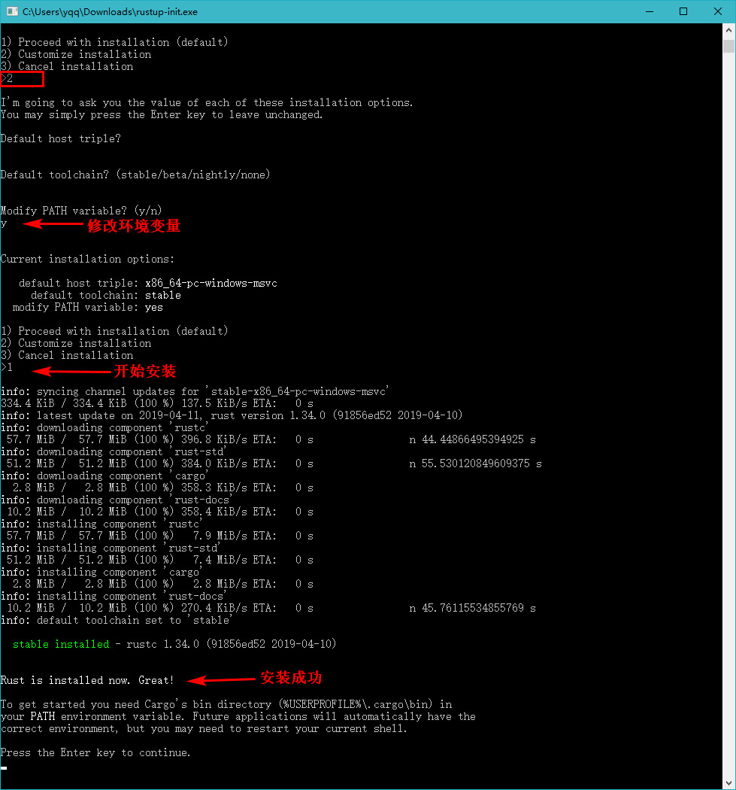
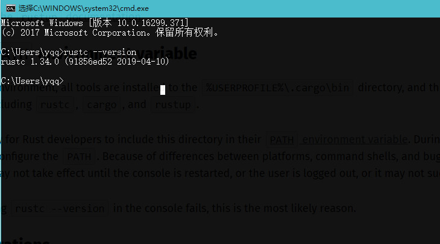
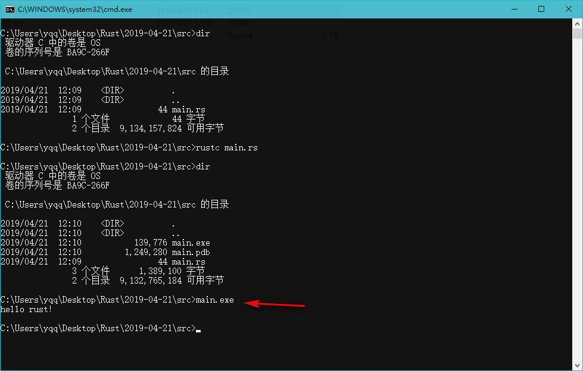

### Windows安装Rust

> https://www.rust-lang.org/install.html  下载`rustup-init.exe`


- 使用 rustup-init.exe 安装 Rust

  


- 查看安装结果




- 查看rust自带的离线文档

  `rustup doc`


### HelloWorld


- 新建`main.rs`

  ```rust
  fn main(){
      println!("hello rust!"); //调用println宏
  }
  ```

- 编译并运行

  


### Cargo 工具使用

- `cargo projectName` :创建项目
- `cargo build`: 构建项目, 会生成可执行程序
- `cargo run`: 构建项目, 并运行
- `cargo check`: 检查项目, 不会生成可执行程序

> cargo官方文档: <https://doc.rust-lang.org/cargo/>