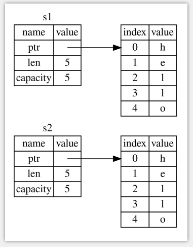
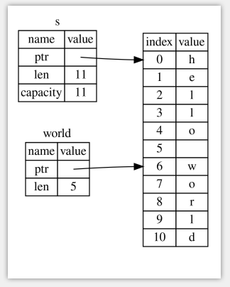

# **Rust 之旅**


## 杂谈

目前, Rust在国内应用不广, Rust开发人员也很少, 中文技术文档不多. Rust的学习难度也比较大, 比学习C++的难度大. Rust借鉴了很多编程语言的有点, 包括C++, Java, Golang, Python, JavaScript, Haskell, ...等等, 其中借鉴C++和Golang的成分是最多的. 

在区块链领域, 很多新的区块链项目都选择用Rust作为第一开发语言, 主要是出于安全和性能方面考虑. 

不管选择哪种编程语言,要想写出安全,稳定,高性能,代码可读性好,可维护性高的项目,都是需要大量的经验积累. 冰冻三尺,非一日之寒. 

编程语言没有优劣之分, 不同的编程语言有各自所长, 有各自不同的适用场景, 所以, 选择哪种编程语言作为项目的第一语言时, 应具体情况具体分析, 不能盲目迷信某种编程语言或某种技术.

学习一门技术是有成本的, 需要付出时间和精力. 就像投资, 每个人都有不同的投资理念. 有些人做短期投资, 例如:学习那些热门的技术但是技术更新非常快,两三年后就过时了; 有些人做长期投资, 例如: 学习那些将来会大有可为的技术,或许是五年后十年后. 

人的时间和精力是有限的, 只能在有限的时间里用有限的精力学习那些最有投资价值的东西. 这些有价值的东西一般都是抽象的, 而不是具体的.


人各有志. 不要轻易做重大决定, 也不要轻易放弃重大决定. 更不要因为别人的三言两语而放弃.

祝 Rust之旅,旅途愉快!

*2020-06-26 于深圳*


---


> - Rust官方文档: https://doc.rust-lang.org/book/
> - Rust中文文档: https://kaisery.github.io/trpl-zh-cn/
> - 通过例子学Rust(英文): https://doc.rust-lang.org/stable/rust-by-example/
> - 通过例子学Rust(中文): https://rustwiki.org/zh-CN/rust-by-example/
> - Cargo文档: https://doc.rust-lang.org/cargo/


## 第1章  入门指南

### 安装 Rust
- Linux , MacOS上安装Rust
    ```shell
    curl --proto '=https' --tlsv1.2 -sSf https://sh.rustup.rs | sh
    ```

- Windows安装Rust
    > https://kaisery.github.io/trpl-zh-cn/ch01-01-installation.html#%E5%9C%A8-windows-%E4%B8%8A%E5%AE%89%E8%A3%85-rustup
    
    https://www.rust-lang.org/tools/install
    
- 检查
    ```
    rustc --version
    ```

### Hello, World

- 新建文件 `main.rs`
    ```rust
    fn main() {
        println!("Hello, world!");
    }
    ```

- 编译
    ```
    rustc main.rs
    ```
- 运行 
    ```
    ./main
    ```

### Cargo 的使用
Cargo 是 Rust 的构建系统和包管理器, 大多数 Rustacean 们使用 Cargo 来管理他们的 Rust 项目，因为它可以为你处理很多任务，比如构建代码、下载依赖库并编译这些库.

#### 常用命令
  
  - `cargo new xxx` :    新建二进制crate
  - `cargo new xxx --lib` :  新建 lib crate
  - `cargo build`:  编译代码
  - `cargo check`:  编译检查代码
  - `cargo run` :  编译并运行
  - `cargo build --release` :  编译release版
  - `cargo clean` : 删除target目录
  - `cargo test`: 运行测试用例
  - `cargo update`: 使用cargo.toml获取最新版的crate, 并将版本号写入Cargo.lock中保存
  

#### Hello world
  
  ```
  cargo new helloworld

  cd helloworld

  cargo run

  ```

#### Cargo配置国内镜像源

cargo默认的源在国外, 下载速度很慢, 可以换成国内源(中科大)

在`~/.cargo/`目录下创建文件`config`

```
[source.crates-io]
registry = "https://github.com/rust-lang/crates.io-index"
replace-with = 'ustc'
[source.ustc]
registry = "git://mirrors.ustc.edu.cn/crates.io-index"
```

再在`~/.bashrc`中添加添加环境变量

```
export RUSTUP_DIST_SERVER=https://mirrors.ustc.cn/rust-static
export RUSTUP_UPDATE_ROOT=https://mirrors.ustc.cn/tust-static/rustup
```

使配置生效

`source ~/.bashrc`


#### Cargo 常见问题处理
  
cargo run时遇到 `Blocking waiting for file lock on package cache` 
- 方法: 删除 `~/.cargo/.package-cache`


## 第2章  编写 "猜猜看" 游戏


Cargo.lock: 文件用于保证所用的库的版本一致, 当执行 `cargo update`时使用cargo.toml获取最新版的crate, 并将版本号写入Cargo.lock中保存


```rust
use rand::Rng;
use std::cmp::Ordering;
use std::io;

fn main() {
    // println!("Hello, world!");

    println!("欢迎进入猜猜看!");
    println!("请输入你猜测的数字:");

    let rand_num = rand::thread_rng().gen_range(1, 100);

   
    loop {

        let mut guess_num = String::new(); // 关联函数(associate function),  C++中的静态方法
        io::stdin().read_line(&mut guess_num).expect("读取错误!");
    
        // 这种方式, 在输入无效数字情况下会导致程序崩溃退出
        // let number: u32 = guess_num.trim().parse().expect("please input a number ");

        // 使用 trim() 去掉 '\n'
        // 使用 parse 将将字符串转换为 u32
        // 使用 match 对  parse返回的  Result<F, F::Err> 进行匹配处理
        let number: u32 = match guess_num.trim().parse() {
            //处理无效输入
            Ok(num) => num,
            Err(err) => {
                println!("error:{}, please input right number", err);
                continue
            }
        };
    
        // 进行模式匹配
        match number.cmp(&rand_num) {
            Ordering::Less => println!("small"),
            Ordering::Greater => println!("big"),
            Ordering::Equal => {
                println!("yes");
                break;
            } 
        }
        

        /*
        // 也可以使用使用 if ... else  
        if number < rand_num {
            println!("small");
        } else if number == rand_num {
            println!("yes");
            break;
        } else {
            println!("big");
        }
        */

    }
}

```


## 第3章 常见编程概念

### 变量和可变性

在Rust中变量默认是不可变的. 如需可变的变量, 在声明时要指定为`mut`.

```rust
let x = 666; // immutable
//x = 777; //错误, 不可修改不可变变量的值

let mut y = 666; // muttable
y = 777; //ok
```

### 不可变变量和常量的区别

- 不允许对常量使用`mut`
- 使用 `const` 声明常量, 而不是 `let`
- 声明常量时必须注明类型
- 常量可以在任何作用于中声明, 包括全局作用域
- 常量只能设置为常量表达式(即编译时确定的结果), 所以不能是函数或其他在运行时才能计算出结果的值
- 常量的生命周期和程序生命周期一样

```rust
const MAX_POINTS: u32 = 100000;
```


### 隐藏(Shadowing)

隐藏和`mut`的区别:
- 隐藏创建的是一个全新的变量,可以使用新的类型
- 可以复用相同的变量名称


```rust
fn main() {
    let x = 5;
    let x = x + 1;
    let x = x * 2;
    println!("The value of x is: {}", x); // 12

    let x = "x"; //隐藏
    // x = "hello";// error , x仍然是不可变的
}
```

### 数据类型

Rust的数据类型分为两大类: 标量(scalar) 和 复合(compound)

#### 标量类型

整型

|数字字面值|	例子
|---------|-----------|
|Decimal (十进制) |	`98_222`
|Hex (十六进制)	| `0xff`
|Octal (八进制) |	`0o77`
|Binary (二进制) |	`0b1111_0000`
|Byte (单字节字符)(仅限于u8) | `b'A'`


```rust
let n = 120u8;
let n = 100000000; //默认是 i32
let n: i64 = 100000000; 
let n = 100_000_000u32;
let n = b'a'; //97
let n = 0xFFu32; //255;
let n = 0o10; // 8
let n = 0b1111; // 15
```

>注意: 在Rust中, Debug模式下若发生整型溢出, 会导致panic. Release不会检测整型溢出.


浮点型

Rust有两种浮点类型: `f32` 和 `f64`, Rust中默认浮点类型是 `f64`

```rust

let x = 5.50423; // 默认是 f64
let x: f32 = 9.1234; // f32

```

数值运算

```rust
fn main() {
    // 加法
    let sum = 5 + 10;

    // 减法
    let difference = 95.5 - 4.3;

    // 乘法
    let product = 4 * 30;

    // 除法
    let quotient = 56.7 / 32.2;

    // 取余
    let remainder = 43 % 5;
}
```


布尔类型

Rust中的布尔类型: `bool`

```rust
let t = true;
let f: bool = false; // 显式指定类型注解
```

字符类型

Rust中的`char`占4个字节, 代表了一个 Unicode标量.
Unicode 标量值包含从 U+0000 到 U+D7FF 和 U+E000 到 U+10FFFF 在内的值。

```rust
fn main() {
    let c = 'z';
    let z = 'ℤ';
    let ch = '国';
    let jp = 'き';
    let gs = '∮';
    let sum = '∑'; 
    let ko = 'ㄶ'; 


    // 使用emoji https://emojipedia.org/
    let football = '⚽';
    let smail = '😊'; //emoji
    let laughing_crying = '😂'; //emoji
}
```


复合类型: 元组(tuple) 和 数组(array)

元组类型
元组是一个将多个其他类型的值组合进一个复合类型的主要方式。元组长度固定：一旦声明，其长度不会增大或缩小。

```rust

let tup: (i32, f64, u8) = (500, 6.4, 1);
println("{}", tup.0);
println!("{}", tup.1);

```


数组类型
数组中的每个元素的类型必须相同, Rust 中的数组是固定长度的,一旦声明，它们的长度不能增长或缩小。

```rust
let a = [1, 2, 3, 4, 5];
let a: [i32; 5] = [1, 2, 3, 4, 5];
let a = [3; 5];//等效于 [3, 3, 3, 3, 3]

println!("{}", a[0]);
// println!("{}", a[1000]); //编译错误!


let index = 10000;
println!("{}", a[index]); //编译通过, 但是运行时panic


```


### 函数

因为 Rust 是一门基于表达式（expression-based）的语言，这是一个需要理解的（不同于其他语言）重要区别。

语句与表达式的区别:
- 语句(statements): 是执行一些操作但不返回值得指令
- 表达式(expressions): 计算并产生一个值

```rust
fn plus_two(arg: u32) -> u32 {
    let tmp = arg + 1; //以分号结尾的是,语句
    arg += 1 //表达式, 注意没有分号
    // 在 Rust 中，函数的返回值等同于函数体最后一个表达式的值
    // 使用 return 也可以
}

fn main() {
    let a = 9; //语句

    let b = plus_two(a); //函数调用是表达式 , let b = xxx; 整体则是语句
}
```


### 代码注释

单行注释, 多行注释, 文档注释
```rust
// 注释
/* 注释 */

/// 这是一个文档注释
fn foo() {
}
```

### 控制流

#### `if` 表达式

```rust

fn main() {
    let number = 6;

    if number % 4 == 0 {
        println!("number is divisible by 4");
    } else if number % 3 == 0 {
        println!("number is divisible by 3");
    } else {
        println!("other");
    }


    // 类似其他C++中的三目运算符
    let condition = true;
    let number = if condition {
        5  //类型必须相同
    } else {
        6  //类型必须相同
        // "str"  // error!!
    };


    // 使用 if let 
    if let a = 9 {
        println!("a = {}", 9);
    }
}

```

#### 循环语句, loop, while, for

只有`loop` 循环可以使用 `break` 从循环中返回值

```rust

fn main() {

    //无限循环
    /*
    loop {
        println!("ok......");
    }
    */

    // 从循环返回(可以带上返回值), 这一点与其他语言不通
    let mut n = 0;
    let result = loop {
        n += 1;
        if n == 10{
            break n * 2;  // 将 n * 2 作为循环的返回值
        }
    };
    println!("result = {}", result);


    /*
    let mut n = 0;
    let result = while true {
        n += 1;
        if n == 10{
            // can only break with a value inside `loop` or breakable block
            break n * 2;   // 编译错误
        } 
    }
    println!("result = {}", result);
    */

    let mut counter = 0;

    let result = loop {
        counter += 1;

        if counter == 10 {
            break counter * 2;
        }
    };

    println!("The result is {}", result); 


    // for 循环

    let mut sum = 0;
    for i in 0..100 {
        sum += i;
    }
    println!("sum = {}", sum);


    let a  = [1, 2, 3, 4, 5, 6];

    for it in a.iter() {
        //it 是(引用)迭代器

        // println!("the value is {}", *it); //OK, 手动解引用
        println!("the value is {}", it); //ok, Rust 会自动解引用
    }

}

```


## 第4章  所有权

所有权规则

> - Each value in Rust has a variable that’s called its owner.
>- There can only be one owner at a time.
> - When the owner goes out of scope, the value will be dropped.

- 1.Rust 中的每一个值都有一个被称为其 所有者（owner）的变量。
- 2.值有且只有一个所有者(在同一时间)。
- 3.当所有者（变量）离开作用域，这个值将被丢弃。

https://kaisery.github.io/trpl-zh-cn/ch04-01-what-is-ownership.html


#### Rust变量与数据交互的方式(1): 移动

Rust借鉴了C++11中的右值引用, Rust青出于蓝而胜于蓝.

回顾一下C++11中的右值引用

```cpp
#include <iostream>
#include <vector>
#include <string>
#include <utility>

int main() 
{
    // https://en.cppreference.com/w/cpp/utility/move

    std::string strtmp = "c++ string";
    std::string strnew(std::move(strtmp));
    std::cout << "strtmp:" << strtmp << std::endl; //空
    std::cout << "strnew:" << strnew  << std::endl;

}
```

Rust中的所有权的转移

```rust
fn main() {
    let s1 = String::from("hello");
    let s2 = s1; //此处将 s1 的所有权 移交给了 s2,  s1不再有效
    // println!("s1: {}", s1); //编译报错: value borrowed here after move
    println!("s2: {}", s2);
}
```

`s1` 被移动到了 `s2` 之后, `s1` 不再有效.  也就不存在多次释放的问题


####  Rust变量与数据交互的方式(2): 克隆

即深拷贝

```rust
fn main() {
    let s1 = String::from("hello");
    let s2 = s1.clone();
    println!("s1 = {}, s2 = {}", s1, s2);
}
```




#### Rust变量与数据交互的方式(3):  拷贝栈上的数据
在编译时已知大小的类型被整个存储在栈上，所以拷贝其实际的值是快速的

任何简单标量值的组合可以是 Copy 的，不需要分配内存或某种形式资源的类型是 Copy 的, 如下:

- 所有整数类型，比如 u32。
- 布尔类型，bool，它的值是 true 和 false。
- 所有浮点数类型，比如 f64。
- 字符类型，char。
- 元组，当且仅当其包含的类型也都是 Copy 的时候。比如，(i32, i32) 是 Copy 的，但 (i32, String) 就不是。

```rust

fn main() {

    //整型 数组是Copy的
    let x = 5;
    let y = x; 
    println!("x = {}, y = {}", x, y);


    //仅包含Copy的类型栈上数组是 Copy 的
    let a = [1, 2, 3]; // 栈上数组
    let b = a;
    println!("a = {:?}", a);
    println!("b = {:?}", b);

    // 堆上数组不是 Copy的
    let sa = vec![1, 2, 3]; //堆上数组  Vec<i32> 
    let sb = sa; //moved
    // println!("sa = {:?}", sa);  //ERROR
    println!("sb = {:?}", sb);

    // 包含堆上数据 栈上数组不是 Copy的
    let ss = [vec![1,2,3], vec![4, 5, 6]];
    let ss2 = ss; // moved
    // println!("{:?}", ss);  //ERROR
    println!("{:?}", ss2);

    // 布尔类型  是 Copy的
    let bl: bool = false;
    let cl = bl;
    println!("bl = {}, cl = {}", bl, cl); // OK

    //浮点型 f32 和 f64  是Copy的
    let f: f32 = 0.234f32;
    let f2 = f;
    println!("f = {}, f2 = {}", f, f2); //OK

    //字符型 char  是 Copy的
    let ch = '中';
    let ch2 = ch;
    println!("ch = {}, ch2 = {}", ch, ch2); //OK


    //仅包含 Copy类型的 元组
    let tp = (1, 2.4, '国', true, "good", [1, 2, 3]);
    let tp2  = tp;
    println!("tp = {:?}", tp); // OK
    println!("tp2 = {:?}", tp2); //OK
}
```


#### 所有权与函数

变量的所有权总是遵循相同的模式：将值赋给另一个变量时移动它。当持有堆中数据值的变量离开作用域时，其值将通过 drop 被清理掉，除非数据被移动为另一个变量所有

```rust
fn foo() -> String {
    let s = String::from("hello");
    s   //移出
}

fn back(s: String) -> String {
    println!("back() s = {}", s);
    s
}

fn oof(s: String) {   //获取所有权
    println!("oof() s = {}", s);
}

fn main() {

    let s1 = foo();
    println!("s1 = {}", s1); //OK

    let s2 = back(s1); // s1已经被moved, 

    oof(s2); //moved
    // 此处 s1已经无效

    // println!("s2 = {}", s2); //ERROR
}
```

### 引用与借用

引用(reference): 不获取变量的所有权,仅获取变量的值
- 不可变引用, 可变变量和不可变量都可以有不可变引用
- 可变引用, 只有可变变量才有可变引用

借用(borrowing): 以引用作为函数参数称为借用

引用的规则

- 在任意给定时间，要么 只能有一个可变引用，要么 只能有多个不可变引用。
- 引用必须总是有效的


```rust

fn foo(s: &String) {
    println!("foo() s = {}", s);
    // s.push_str("boy");  // ERROR 不可变引用,不可修改
}

fn oof(s: &mut String) {
    println!("oof() s = {}", s);
    s.push_str("boy"); //OK , 可变引用可以修改
}

fn main() {
    let mut s = String::from("hello");
    foo(&s); //借用

    println!("main() s = {}", s);

    oof(&mut s); //可变
}
```


### 切片(Slice)类型


```rust
let s = String::from("hello world");

let hello: &str = &s[0..5];  // &str类型
let world = &s[6..11]; //
```





```rust
//值接受 &String, 不接收 &str
fn first(s: &String) -> &str{
    &s[0..1]
}

//可以接受 &String , 也可以接受 &str
fn second(s: &str) -> &str {
    &s[0..1]
}

fn main() {
    let s = "hello world";
    let s1 = String::from("hello world");
    // println!("{}", first(&s)); //error
    println!("{}", first(&s1)); //OK

    println!("{}", second(&s)); //OK
    println!("{}", second(&s1)); //OK   &String 会自动转为 &str
    println!("{}", second(&s1[..])); //OK  即 &s1[..]
}
```

其他类型的slice

```rust
fn main() {
    let a = [1, 2, 3, 4];
    println!("{:?}", &a[..]); // OK
    println!("{:?}", &a[2..]); // OK

    let sa = vec![1, 2, 3, 4];
    println!("{:?}", &sa[..]); // OK
    println!("{:?}", &sa[2..]); // OK

    //元组不支持切片
    // let tp = (1, 2, 3, 4);
    // println!("{:?}", &tp[..]); // ERROR 
    // println!("{:?}", &tp[2..]); // ERROR
}
```


## 第5章 结构体

结构体分类:

- 普通结构体: 包含数据字段的 
- 元组结构体: 没有字段名称, 只有字段类型
- 类单元结构体: 不包含数据字段的, 仅用来实现某些trait


```rust

struct User {
    username: String,
    email: String,
}

/*
struct User {
    username: &str, //结构体中使用引用, 需要考虑引用的生命周期
    email: &str,
}
*/


struct Color(u8, u8, u8); //元组结构体
struct Point3D(f64, f64, f64);

struct CanFly; //没有数据字段, 类单元结构体


fn build_user(email: String, username: String) -> User {
    // 变量与字段同名时, 初始化可以简写(需要写出字段名称)
    User{
        username,
        email,
    }
}

fn main() {

    // let usr = User {"yqq", "1234@gmail.com" }; //ERROR

    let usr = build_user(String::from("yqq"), 
            String::from("123@gmail.com"));

    let usr2 = User {
        //只能用String, 不能用字符串字面值(&str), 因为生命周期的问题
        username: String::from( "yqq" ), 
        email: String::from( "234@gmail.com" )
    };

    let black = Color(0, 0, 0);

    let p = Point3D(1.23, -234.12, 992.999);
}
```

为结构体实现方法

```rust
struct Rectangle {
    width: u32,
    height: u32,
}

impl Rectangle {
    fn area(&self) -> u32 {
        self.width * self.height
    }

    //关联方法, 在C++中叫静态方法
    fn name() -> String {
        String::from("Rectangle")
    }
}

impl Rectangle {
    fn get_width(&self) -> u32 {
        self.width
    }
}

fn main() {
    let rect = Rectangle { 
        width: 100,
        height: 100,
    };

    println!("面积: {}", rect.area());
    println!("name: {}", Rectangle::name());
    println!("width:{}", rect.get_width());
}
```


## 第6章 枚举与模式匹配

主要内容:
- `enum`
- `Option`
- `match`


枚举类型

```rust
enum Message {
    Quit,  //没有关联数据
    Move { x: i32, y: i32 },  //匿名结构体
    Write(String), //包含String
    ChangeColor(i32, i32, i32), //包含3个i32
}

// 可以为 枚举类型实现 方法
impl Message {
    fn call(&self) {
        println!("call()");
    }
}

fn main() {
    let m = Message::Write(String::from("good"));
    m.call();
}
```


`Option` ,  `match` ,   `if let`

Option: Rust中使用 Option<T>对空和非空进行处理

match: 使用match可以进行模式匹配, 模式可由字面值,变量,通配符和其他内容组成. match 的匹配必须是 "穷尽" 的, 即必须匹配所有可能性.

if let: 可以进行简单的模式匹配

```rust
enum Option<T> {
    Some(T),
    None,
}
```

```rust
fn some_func(x: i32) -> Option<i32> {
    if x < 0 {
        return None;
    }
    Some(x + 1)
}


fn main() {

    for i in -3..3 {
        //对函数返回值进行检查
        match some_func(i) {
            None => println!("minus"),
            Some(n) => println!("{}", n),
        };
    }

    let n = 8;
    match n {
        1 => println!("1"),
        2 => println!("2"),
        _ => println!(">=3"),  // _ 匹配所有的值
    };

    let n = Some(3);
    if let Some(3) == n {
        println!("3");
    }

    if let Some(num) = some_func(55) {
        println!("some_func return: {}", num);
    }
}

```


## 第7章 包管理

- 包（Packages）： Cargo 的一个功能，它允许你构建、测试和分享 crate。
- Crates ：一个模块的树形结构，它形成了库或二进制项目。
- 模块（Modules）和 use： 允许你控制作用域和路径的私有性。
- 路径（path）：一个命名例如结构体、函数或模块等项的方式


包的规则:
- 一个包至多只能包含一个库crate(library crate)
- 一个包中可以包含任意多个二进制crate(binary crate)
- 包中至少包含一个crate, 无论是库crate还是二进制crate


常用操作:
- cargo new demo  创建二进制crate
- cargo new libdemo --lib   创建库crate
- 如果一个包同时含有 `src/main.rs` 和 `src/lib.rs`, 则它有两个crate: 一个库crate和一个二进制crate, 且crate的名字都与包相同
- 可以将文件放在 `src/bin`目录下, 这样, 一个包就可以有多个二进制crate: `src/bin`目录下的每个文件都会被编译成不同二进制crate


一个lib crate 多个 binary crate, 的包结构

```
canteen
├── Cargo.lock
├── Cargo.toml
├── src
│   ├── bin
│   │   ├── demo2.rs
│   │   └── demo.rs
│   └── lib.rs
└── target

```

一个lib crate  一个binary crate, 的包结构

```
canteen2
├── Cargo.lock
├── Cargo.toml
├── src
│   ├── lib.rs
│   └── main.rs
└── target

```

结构体成员默认是私有的
枚举成员默认是公有的


```rust
use crate::front_of_house::hosting::add_to_waitlist; //引入作用域

use std::io::Result as IoResult; //别名

pub use crate::front_of_house::hosting; // 重新导出

use std::{cmp::Ordering, io};
use std::io::{self, Write};

use std::collections::*; //将所有的公有定义引入作用域

```


### 将模块分割进不同文件

```
canteen3
├── Cargo.lock
├── Cargo.toml
├── src
│   ├── front_of_house
│   │   └── hosting.rs
│   ├── front_of_house.rs
│   ├── lib.rs
│   └── main.rs
└── target
```


文件: `src/main.rs`
```rust
use canteen3::eat_at_restaurant;
fn main() {
    eat_at_restaurant();
    println!("this is demo");
}
```

文件: `src/lib.rs`
```rust
// mod 关键字声明了模块，
//Rust 会在与模块同名的文件中查找模块的代码。
mod front_of_house;  

pub use crate::front_of_house::hosting;

pub fn eat_at_restaurant() {
    hosting::add_to_waitlist();
    hosting::add_to_waitlist();
    hosting::add_to_waitlist();
}
```

文件: `src/front_of_house.rs`
```rust
pub mod hosting;
```

文件: `src/front_of_house/hosting.rs`

```rust
pub fn add_to_waitlist() {
    println!("canteen3: add_to_waitlist... ");
}
```


## 第8章 常见集合

主要内容:
- `Vec<T>` : 堆上数组
- `String`: 堆上字符串
- `Hasmap<K, V>`: KV数据结构, 同样在堆上


#### vector

```rust

enum  MyEnum{
    Int(i32),
    Float(f64),
    Txt(String),
}

fn main() {

    let v2: Vec<f64> = Vec::new();
    let mut v3 = vec![1, 3, 9]; //使用宏, 也是 Vec<iew> 类型

    for it in &mut v3 {
        *it += 100;
    }

    for it in v3 {
        println!("{}", it);
    }

    let vct = vec! [
        MyEnum::Float(1.234),
        MyEnum::Int(12),
        MyEnum::Txt(String::from("good")),
    ];
}
```

#### String 

String 的类型是由标准库提供的，而没有写进核心语言部分，它是可增长的、可变的、有所有权的、UTF-8 编码的字符串类型。

Rust 的字符串不支持索引

原因: 
1. String 是一个 Vec<u8> 的封装。 
2. 每个 Unicode 标量值需要两个字节存储.
3. 索引操作预期总是需要常数时间 (O(1))。但是对于 String 不可能保证这样的性能，因为 Rust 必须从开头到索引位置遍历来确定有多少有效的字符。


```rust 

#[derive(PartialOrd, Eq, Ord)]
#[stable(feature = "rust1", since = "1.0.0")]
pub struct String {
    vec: Vec<u8>,
}

```

Rust的核心语言中字符串指的是 `str` 和 字符串slice即 `&str`

`String`有标准库提供

以上字符串类型都是UTF-8编码

```rust

// String 内部是有  Vec<u8> 进行封装

fn main() {

    let mut s1 = String::from("重庆火锅");
    s1.push('赞'); //Rust的字符指的是 Unicode字符, 而不单指是一个字节ascii
    s1.push_str("非常好吃!");

    s1 += "麻辣火锅!";  
    s1 = s1 + "天下一绝!";

    s1 = format!("{}中国雄起!, {}", s1, "棒棒儿!");
    
    println!("{}", s1);

    // println!("第一个字符: {}", &s1[0]);  // String 不支持索引操作

    let d = "麻辣小面!"; //字面值支持索引操作
    // println!("{}", &d[0..1]); //ERROR, 1不是有效边界
    println!("{}", &d[0..3]); // 麻
    println!("length: {}", d.len()); //13 个字节: 一个汉字占3个字节 感叹号是英文占一个字节


    //这种方式遍历字符串是安全的
    for ch in d.chars() {
        println!("{}", ch);
    }
}
```

#### Hashmap

和C++的`std::map`有点区别:
- HashMap以hash表作为数据结构, C++中的`std::map`使用红黑树
- HashMap插入如果键已经存在时新值替换旧值; C++中`std::map`则插入失败

```rust

use std::collections::HashMap;

fn main() {

    let mut scores = HashMap::new();
    scores.insert("Alice", 10);
    scores.insert("Bob", 199);


    let names = vec!["Alice", "Bob", "Coris"];
    let ages = vec![11, 10, 14];


    let cls: HashMap<_, _> = names.iter().zip(ages.iter()).collect();
    //使用 zip 方法来创建一个元组的 vector，其中 “Blue” 与 10 是一对
    println!("{:?}", cls); //{"Alice": 11, "Coris": 14, "Bob": 10}


    // 所有权
    let name = String::from("name");
    let age = String::from("age");
    let mut tmp = HashMap::new();

    // pub fn insert(&mut self, k: K, v: V) -> Option<V>
    // 从 insert 方法的函数签名来看, k, v 是move
    tmp.insert(name, age); //moved

    println!("{:?}", tmp);
    // println!("name={}, age={}", name, age);

    let s = String::from("name");
    let kv = tmp.get_key_value( &s );
    match kv {
        Some((k, v)) => {
            println!("key:{}, value:{}", k, v);
        },
        None => println!("not found"),
    }

    /*
    for (k,v) in tmp {  // 这种方式是移动! for循环之后tmp就无效了
        println!("k:{:?}, v:{:?}", k, v);
    }
    */

    for (k,v) in &tmp { //这种方式才是借用
        println!("k:{:?}, v:{:?}", k, v);
    }

    tmp.insert("name".to_string(), "messi".to_string());  //如果键已经存在, 则新值替换就值

    // 只有键不存在时才插入
    tmp.entry("name".to_string()).or_insert("news".to_string());

    println!("{:?}", tmp);

    let text = "hello world wonderful world";
    let mut map = HashMap::new();

    for word in text.split_whitespace() {
        // pub fn or_insert(self, default: V) -> &'a mut V
        // 根据 or_insert 的函数签名
        // or_insert会返回一个值得可变引用
        let count = map.entry(word).or_insert(0);
        *count += 1;
    }

    println!("{:?}", map);

}
```

C++中 `std::map` 插入相同的key的情况:

```cpp
#include <iostream>
#include <map>
#include <string>

int main()
{
    std::map<std::string, int> mp;

    //insert方法返回值类型: std::pair<std::map<std::string, int>::iterator, bool>
    auto ret = mp.insert(std::make_pair("name", 234));
    if(!ret.second){
        std::cout << "插入失败" << std::endl;
    }else{
        std::cout << "插入成功" << std::endl;
        auto it = *ret.first;
        std::cout << it.first << " : " << it.second << std::endl;
    }

    ret = mp.insert(std::make_pair("name", 234));
    if(!ret.second){
        std::cout << "插入失败" << std::endl;
    } else {
        auto it = *ret.first;
        std::cout << it.first << " : " << it.second << std::endl;
        std::cout << "插入成功" << std::endl;
    }
}
```
运行输出:
```
插入成功
name : 234
插入失败
```


## 第9章 错误处理

主要内容:
- panic!
- `Result<T, E>`
- 健壮地处理错误


### Result枚举定义

```rust
enum Result<T, E> {
    Ok(T),
    Err(E),
}
```


关于Result的处理

```rust

fn read_string_from_file_v1(path: &String) -> Result<String, io::Error> {
    let f = File::open(path);
    let mut f = match f {
        Ok(file) => file, // 返回文件句柄
        Err(error) => return Err(error), //直接返回
    };

    let mut s = String::new();
    match f.read_to_string(&mut s) {
        Ok(_) => Ok(s),
        Err(e) => Err(e),
    }
}


fn read_string_from_file_v2(path: &String) -> Result<String, io::Error> {
    let mut s = String::new();
    File::open(path)?.read_to_string(&mut s)?;
    Ok(s)
}


fn read_string_from_file_v3(path: &String) -> Result<String, io::Error> {
    fs::read_to_string(path)
}


//main 函数是特殊的，其必须返回什么类型是有限制的。main 函数的一个有效的返回值是 ()，同时出于方便，另一个有效的返回值是 Result<T, E>
fn main() -> Result<(), Box<dyn error::Error>> {

    let path = String::from("tmp.txt");
    /*
    // v1
    let file_content = match read_string_from_file(&s) {
        Ok(content) => content,
        Err(error) => {
            println!("read file error: {}", error);
            return ;
        }
    };
    */

    /*
    // v2
    let file_content =  match read_string_from_file_v2(&path) {
        Ok(content) => content,
        Err(error) => {
            println!("read file error: {}", error);
            return ; 
        }
    };
    */

    // v3
    let file_content  =  read_string_from_file_v3(&path)?;
    println!("file content: {}", file_content);
    Ok(())
}
```


## 第10章 泛型, trait, 生命周期


### 泛型

- 在函数定义中使用泛型
- 在结构体中使用泛型
- 在枚举中使用泛型
- 方法中使用

```rust
use std::cmp::{PartialOrd, PartialEq} ;
// use std::mem::


// 在函数定义中使用泛型
fn largest<T: PartialOrd>(v: &[T]) -> &T {
    let mut max = &v[0];
    for item in v.iter() {
        if item > &max {
            max  = item;
        }
    }
    max
}


//结构体中使用泛型
struct Point<X, Y> {
    x: X, 
    y: Y,
}

impl<X, Y> Point<X, Y> {
    // 方法中使用泛型
    fn mixup<XX, YY>(self, other: Point<XX, YY>) -> Point<X, YY> {
        Point {
            x: self.x,
            y: other.y,
        }
    }
}


fn main() {

    let v = vec![1, -1, 3, 9, 4];
    if let x =  largest(&v) {
        println!("x = {}", x);
    }

    let p1 = Point { x: 5, y: 10.4 };
    let p2 = Point { x: "Hello", y: 'c'};

    let p3 = p1.mixup(p2);

    println!("p3.x = {}, p3.y = {}", p3.x, p3.y);
}

```

泛型代码的性能: 
Rust在编译时对泛型代码进行*单态化*, 即为不同的类型生成相应的代码,  如C++中对泛型的第一次编译.


### trait


trait 以一种抽象的方式定义共享的行为。可以使用 trait bounds 指定泛型是任何拥有特定行为的类型。

注意：trait 类似于其他语言中的常被称为 接口（interfaces）的功能，虽然有一些不同。


实现 trait 时需要注意的一个限制是，只有当 trait 或者要实现 trait 的类型位于 crate 的本地作用域时，才能为该类型实现 trait。

但是不能为外部类型实现外部 trait。


这个限制是被称为 相干性（coherence） 的程序属性的一部分，或者更具体的说是 孤儿规则（orphan rule），其得名于不存在父类型。这条规则确保了其他人编写的代码不会破坏你代码，反之亦然。


因为向编译器提供了 trait bound 信息, 编译器就可以检查具体类型的行为, 相比动态语言在运行时出现错误,Rust将这些错误移到了编译时, 另外, 无需在运行时检查方法是否存在, 因为编译时已经检查过.


个人心得:
Rust语言部分包含了很多和编译器打交道的内容, 相比其他语言来说 , Rust要求程序员非常清楚自己想要什么和在做什么,并且把这些告诉编译器,让编译器协助检查,保证正确性.


使用 trait bound 实现 上面的  `largest` 函数, 和上面的版本差不多, 增加了 Copy 的trait bound , for 循环中使用 `&item`引用

```rust
use std::cmp::PartialOrd;
// use std::c


fn largest<T>(v: &[T] ) -> T  where T: PartialOrd + Copy {
    let mut max = v[0];
    for &item in v.iter() {
        if item > max {
            max = item;
        }
    }

    max
}

fn main() {
    let number_list = vec![34, 50, 25, 100, 65];

    let result = largest(&number_list);
    println!("The largest number is {}", result);

    let char_list = vec!['y', 'm', 'a', 'q'];

    let result = largest(&char_list);
    println!("The largest char is {}", result);
}

```


#### trait 对象

后文有trait的内容: https://kaisery.github.io/trpl-zh-cn/ch17-02-trait-objects.html


```rust
pub trait Mammal {
    fn eat(&self);
}

struct Human;
struct Dog;
struct God {
    pub lifes: Vec<Box<dyn Mammal>>,
}

impl God {

    // fn live_multi_v2(m: &[ Box<dyn Mammal> ]){
    pub fn live_multi_v2(&self){
        for item in self.lifes.iter() {
            item.eat();
        }
    }
}

impl Mammal for Human {
    fn eat(&self) {
        println!("human eat");
    }
}


impl Mammal for Dog {
    fn eat(&self) {
        println!("Dog eat");
    }
}

// fn live_multi<T>(m: &[T]) where T: Mammal { // error
// fn live_multi(m: &[Box<dyn Mammal>]) {  // &[std::boxed::Box<(dyn Mammal + 'static)>]
// fn live_multi(m: &[Box<dyn Mammal>]) {
fn live_multi(m: &Vec<Box<dyn Mammal>>) {
    for item in m.iter() {
        item.eat();
    }
}


fn main() {


    // let god = God{
    //     lifes:
    //     vec![ 
    //         Box::new(Human{}), 
    //         Box::new(Dog{}) ,
    //     ] 
    // };

    // god.live_multi_v2();

    //如果不加类型注解, 编译器会将v的类型推导为: std::vec::Vec<std::boxed::Box<Human>>
    // let v = vec![ 
    //     Box::new(Human), 
    //     Box::new(Dog) ,
    // ]; 


    let v: std::vec::Vec<std::boxed::Box<(dyn Mammal)>>  = vec![ 
        Box::new(Human), 
        Box::new(Dog) ,
    ];

    live_multi(&v); //ok
    // live_multi(&v[..]); //ok

}

```


### 生命周期

生命周期(lifetime)是Rust最与众不同的功能.


Rust编译器有 借用检查器(borrow checker) , 它会比较作用域来判断所有的借用是否有效.

如果被引用的对象比它的引用者存在的时间更短, 那么引用无效.


```rust
fn longest(x : &str, y: &str) -> &str {
    if x.len() > y.len() {
        x
    } else {
        y
    }
}
```


```rust

// 通过在函数签名中指定生命周期参数时，
// 我们并没有改变任何传入后返回的值的生命周期。
// 而是指出任何不遵守这个协议的传入值都将被借用检查器拒绝。

// 泛型生命周期 'a  的具体生命周期  等于  x, y 两者生命周期较小者的生命周期
// 因此
// 就能保证返回的引用值在 x 和 y 中较短的那个生命周期结束之前保持有效。
fn longest<'a>(x : &'a str, y: &'a str) -> &'a str {
    if x.len() > y.len() {
        x
    } else {
        y
    }
}
```

生命周期语法是用于将函数的多个参数与其返回值的生命周期进行关联的。一旦他们形成了某种关联，Rust 就有了足够的信息来允许内存安全的操作并阻止会产生悬垂指针亦或是违反内存安全的行为。


```rust


// 函数或方法的引用参数
fn longest<'a>(x: &'a str, y: &'a str) -> &'a str {
    if x.len() > y.len() {
        x
    } else {
        y
    }
}


fn longest_v2<'a, 'b>(x: &'a str, y: &'a str)  -> &'a str {
    if x.len() > y.len() {
        x
    } else {
        y
    }
}


// //the reference is valid for the lifetime `'c` as defined on the function body at 23:23
// //but the borrowed content is only valid for the lifetime `'b` as defined on the function body at 23:19
// fn longest_v3<'a, 'b, 'c>(x: &'a str, y: &'b str)  -> &'c str {
//     if x.len() > y.len() {
//         x
//     } else {
//         y
//     }
// }


struct Coin<'a> {
    symbol: &'a str,
}


fn precious<'a>(x: &'a Coin, y: &'a Coin) -> &'a Coin<'a>{

    /*
    //OK
    if x.symbol.len() > y.symbol.len() {
        x
    } else {
        y
    }
    */


    /*
    // OK
    if x.symbol.len() > y.symbol.len() {
        return x;
    }
    return y;
    */

    if x.symbol.len() > y.symbol.len() {
        x;   // ^ expected `()`, found `&Coin<'_>`
        println!("x is {}", x.symbol);
        // return x;  //OK
    }
    y
}


/*

// OK

struct  Singer<'a> {
    name: &'a str,
    musics: &'a Box<Vec<String>>,
}

impl <'a>Singer<'a> {
    fn show(&'a self, music_name: &'a str) -> &'a str {
        for item in self.musics.iter() {
            if item == music_name {
                return item;
            }
        }
        &self.musics[0]
    }
}
*/


// OK
struct  Singer<'a, 'b> {
    name: &'a str,
    musics: &'b Box<Vec<String>>,  //如果换成  Vec<str> 则编译不过, 因为 str需要编译时期确定大小?
}

impl <'a, 'b>Singer<'a, 'b> {
    fn show(&'a self, music_name: &'b str) -> &'a str {
        for item in self.musics.iter() {
            if item == music_name {
                return item;
            }
        }
        &self.musics[0]
    }
}

fn main() {

    let a = String::from("hello");
    let b = String::from("good");

    let r = longest(&a,  &b);
    println!("longest is : {}", r);


    let r = longest_v2(&a, &b);
    println!("longest is : {}", r);


    // let r = longest_v3(&a, &b);
    // println!("longest is : {}", r);

    // drop(a); //moved
    let cny = Coin {symbol: &a};
    let usd = Coin {symbol: "USD" };

    let p =  precious(&cny, &usd);
    println!("precious: {}", p.symbol);


    let bx  = Box::new(vec![
        "toooooo".to_string(),
        "shut".to_string(),
        "apple".to_string(),
        "he is ok".to_string(),
    ]);

    {
        let sg = Singer { name:"gous", musics: &bx};
        let name = "apple";
        let ret = sg.show( &name );
        println!("ret = {}", ret);
    }

    // println!("{:?}", bx);
    
}

```


### 生命周期省略规则

在一些特定的情况下不需要指定生命周期:

The first rule is that each parameter that is a reference gets its own lifetime parameter. In other words, a function with one parameter gets one lifetime parameter: `fn foo<'a>(x: &'a i32);` a function with two parameters gets two separate lifetime parameters: `fn foo<'a, 'b>(x: &'a i32, y: &'b i32)`; and so on.

The second rule is if there is exactly one input lifetime parameter, that lifetime is assigned to all output lifetime parameters: `fn foo<'a>(x: &'a i32) -> &'a i32`.

The third rule is if there are multiple input lifetime parameters, but one of them is `&self` or `&mut self` because this is a method, the lifetime of self is assigned to all output lifetime parameters. This third rule makes methods much nicer to read and write because fewer symbols are necessary.


第一条规则是每一个是引用的参数都有它自己的生命周期参数。换句话说就是，有一个引用参数的函数有一个生命周期参数：`fn foo<'a>(x: &'a i32)`，有两个引用参数的函数有两个不同的生命周期参数，`fn foo<'a, 'b>(x: &'a i32, y: &'b i32)`，依此类推。

第二条规则是如果只有一个输入生命周期参数，那么它被赋予给所有输出生命周期参数：`fn foo<'a>(x: &'a i32) -> &'a i32`。

第三条规则是如果方法有多个输入生命周期参数并且其中一个参数是 &self 或 &mut self，说明是个对象的方法(method)(译者注： 这里涉及rust的面向对象参见17章), 那么 self 的生命周期赋予给所有输出生命周期参数。第三条规则使得方法更容易读写，因为只需更少的符号。


```rust


//如果只有一个输入生命周期参数，那么它被赋予给所有输出生命周期参数
// fn show_append_suffix(x: &mut String) ->  &str {
fn show_append_suffix<'a>(x: &'a mut String) ->  &'a str {
    // x + "suffix"
    x.push_str("_suffix");
    &x[..]
}


struct Bottle<'a> {
    label: &'a str,
    cap: f64,
}

impl<'a > Bottle<'a > {
    //等效: fn get_label<'b>(&'a self, prefix: &'b str) -> &'a str {
    fn get_label(&self, prefix: &str) -> &str {
        println!("prefix:{}, {}:{}", prefix, self.label, self.cap);
        self.label
    }


    // 如果是方法, self的生命周期将被赋给所有输出生命参数
    // fn get_label_v2<'b>(&'a self, prefix: &'b str) -> &'a str {
    /*fn get_label_v2(&self, prefix: &str) -> &str { //等效上面的写法, 编译不过!
        println!("prefix:{}, {}:{}", prefix, self.label, self.cap);
        prefix
    }*/


    // fn get_label_v3<'b>(&'a self, prefix: &'b str) -> &'a str {
    /*fn get_label_v3(&self, prefix: &str) -> &str { //等效于上面的写法, 编译不过!
        println!("prefix:{}, {}:{}", prefix, self.label, self.cap);
        if self.label.len() >  prefix.len() {
            self.label
        } else {
            prefix
        }
    }*/

    // 必须加生命周期注解, 'a 是 min('a, 'b),  即生命周期最短的那个
    // fn get_label_v4(&'a self, prefix: &'a str) -> &'a str {
    fn get_label_v4(&self, prefix: &'a str) -> &str {
        println!("prefix:{}, {}:{}", prefix, self.label, self.cap);
        if self.label.len() > prefix.len() {
            self.label 
        } else {
            prefix
        }
    }

    // fn get_longest(&self, x: &str, y: &str) -> &str {
    fn get_longest(&self, x: &'a str, y: &'a str) -> &str {
        if x.len() > y.len() {
            x
        } else {
            y
        }
    }
}


fn main() {
    let mut x = String::from("good");
    let rf = show_append_suffix(&mut x);

    // 在任意给定时间，只能拥有"一个可变引用"或"任意数量的不可变引用之一"（而不是全部）。
    // println!("x = {}", &x); 
    println!("rf= {}", &rf);


    let bt = Bottle {label: "hope", cap:0.2234};
    let label  = bt.get_label("good");
    println!("label: {}", label);


    let longer = bt.get_longest("short", "longest");
    println!("longer: {}", longer);

}


```


关于  Option<T>

为了拥有一个可能为空的值，你必须要显式的将其放入对应类型的 `Option<T>` 中。接着，当使用这个值时，必须明确的处理值为空的情况。只要一个值不是 `Option<T>` 类型，你就 可以 安全的认定它的值不为空。


模块系统（the module system）包括：

包（Packages）： Cargo 的一个功能，它允许你构建、测试和分享 crate。
Crates ：一个模块的树形结构，它形成了库或二进制项目。
模块（Modules）和 use： 允许你控制作用域和路径的私有性。
路径（path）：一个命名例如结构体、函数或模块等项的方式


一个包中至多 只能 包含一个库 crate(library crate)；
包中可以包含任意多个二进制 crate(binary crate)；
包中至少包含一个 crate，无论是库的还是二进制的。


Cargo 遵循的一个约定：src/main.rs 就是一个与包同名的二进制 crate 的 crate 根。同样的，Cargo 知道如果包目录中包含 src/lib.rs，则包带有与其同名的库 crate，且 src/lib.rs 是 crate 根。crate 根文件将由 Cargo 传递给 rustc 来实际构建库或者二进制项目。

如果一个包同时含有 src/main.rs 和 src/lib.rs，则它有两个 crate：一个库和一个二进制项，且名字都与包相同。通过将文件放在 src/bin 目录下，一个包可以拥有多个二进制 crate：每个 src/bin 下的文件都会被编译成一个独立的二进制 crate

Rust 中默认所有项（函数、方法、结构体、枚举、模块和常量）都是私有的。父模块中的项不能使用子模块中的私有项，但是子模块中的项可以使用他们父模块中的项。


UTF-8 中的中文占3个字节, 

遍历字符串可以使用 chars 方法


```rust

// 如果你需要操作单独的 Unicode 标量值，最好的选择是使用 chars 方法。
// chars 方法会将字符串分开并返回 char 类型的值
for ch in "北京烤鸭!Beijing Duck!".chars() {
    println!("{}", ch);
}

```


Rust 将错误组合成两个主要类别：可恢复错误（recoverable）和 不可恢复错误（unrecoverable）。
- 可恢复错误通常代表向用户报告错误和重试操作是合理的情况，比如未找到文件。
- 不可恢复错误通常是 bug 的同义词，比如尝试访问超过数组结尾的位置。


我们可以设置 RUST_BACKTRACE 环境变量来得到一个 backtrace。

```rust

enum Result<T, E> {
Ok(T),
Err(E),
}

```


只要每一个错误类型都实现了 from 函数来定义如将其转换为返回的错误类型，? 运算符会自动处理这些转换。

?运算符: 只能用于返回 Result 或者其它实现了 std::ops::Try 的类型的函数


```rust


/*
match 表达式与问号运算符所做的有一点不同：? 运算符所使用的错误值被传递给了 from 函数，
它定义于标准库的 From trait 中，其用来将错误从一种类型转换为另一种类型。
当 ? 运算符调用 from 函数时，收到的错误类型被转换为定义为当前函数返回的错误类型。
这在当一个函数返回一个错误类型来代表所有可能失败的方式时很有用，
即使其可能会因很多种原因失败。只要每一个错误类型都实现了 from 
函数来定义如将其转换为返回的错误类型，? 运算符会自动处理这些转换。
*/
fn read_username_from_file_ex() -> Result<String, io::Error> {
    let mut f = File::open("hello.txt")?; // 使用 ? 运算符自动转换错误
    let mut s = String::new();
    f.read_to_string(&mut s)?;
    Ok(s)
}

```


panic! 适用场景:

- 示例 , 代码原型, 测试用例

- panic! 通常适合调用不能够控制的外部代码时，这时无法修复其返回的无效状态。


测试

- panic!
- should_panic! 
- assert!


闭包

闭包定义会为每个参数和返回值推断一个具体类型


```rust

et example_closure = |x| x;

let s = example_closure(String::from("hello"));
let n = example_closure(5);

```


在 Rust 中，迭代器是 惰性的（lazy）


Iterator trait 需要实现 next 方法, 因为一些方法中调用了 next 方法
这些调用 next 方法的方法被称为 消费适配器（consuming adaptors）


迭代器是 Rust 的 零成本抽象（zero-cost abstractions）之一，它意味着抽象并不会引入运行时开销，它与本贾尼·斯特劳斯特卢普（C++ 的设计和实现者）在 “Foundations of C++”（2012） 中所定义的 零开销（zero-overhead）


Cargo 工作空间

工作空间 是一系列共享同样的 Cargo.lock 和输出目录的包。
我们的工作空间有一个二进制项目和两个库。二进制项目会提供主要功能，并会依赖另两个库。


智能指针


智能指针区别于常规结构体的显著特性在于其实现了 Deref 和 Drop trait。

Deref trait 允许智能指针结构体实例表现的像引用一样，这样就可以编写既用于引用、又用于智能指针的代码。

Drop trait 允许我们自定义当智能指针离开作用域时运行的代码。


常用的智能指针

Box<T>，用于在堆上分配值
Rc<T>，一个引用计数类型，其数据可以有多个所有者
Ref<T> 和 RefMut<T>，通过 RefCell<T> 访问，一个在运行时而不是在编译时执行借用规则的类型。


Box<T>  数据存放在堆上 ,  而指向堆数据的指针在栈上

- 当有一个在编译时未知大小的类型，而又想要在需要确切大小的上下文中使用这个类型值的时候
- 当有大量数据并希望在确保数据不被拷贝的情况下转移所有权的时候
- 当希望拥有一个值并只关心它的类型是否实现了特定 trait 而不是其具体类型的时候

    第1种: 递归类型(如通过指针实现链表)
    第2种: 大数据量拷贝
    第3种: trait 对象 

    *y  底层是  *(y.deref())


注意，每次当我们在代码中使用 * 时， * 运算符都被替换成了先调用 deref 方法再接着使用 * 解引用的操作，且只会发生一次，不会对 * 操作符无限递归替换，解引用出上面 i32 类型的值就停止了


解引用强制多态（deref coercions）是 Rust 在函数或方法传参上的一种便利。其将实现了 Deref 的类型的引用转换为原始类型通过 Deref 所能够转换的类型的引用。当这种特定类型的引用作为实参传递给和形参类型不同的函数或方法时，解引用强制多态将自动发生。这时会有一系列的 deref 方法被调用，把我们提供的类型转换成了参数所需的类型。

解引用强制多态的加入使得 Rust 程序员编写函数和方法调用时无需增加过多显式使用 & 和 * 的引用和解引用。这个功能也使得我们可以编写更多同时作用于引用或智能指针的代码。

当所涉及到的类型定义了 Deref trait，Rust 会分析这些类型并使用任意多次 Deref::deref 调用以获得匹配参数的类型。这些解析都发生在编译时，所以利用解引用强制多态并没有运行时惩罚！


```rust


fn foo(name: &str) {
    println!("hello , {}", name);
}

let m = MyBox::new(String::from("rustman"));
foo(&m);
foo( &(*m)[..] )  // Rust 没有解引用强制多态则必须编写的代码

```


Rust 在发现类型和 trait 实现满足三种情况时会进行解引用强制多态：

当 `T: Deref<Target=U>` 时从 &T 到 &U。
当 `T: DerefMut<Target=U> `时从 &mut T 到 &mut U。
当 `T: Deref<Target=U> `时从 &mut T 到 &U。

std::mem::drop 进行提前清理
我们也无需担心意外的清理掉仍在使用的值，这会造成编译器错误：所有权系统确保引用总是有效的，也会确保 drop 只会在值不再被使用时被调用一次。


Rc<T> 引用技术智能指针
注意 Rc<T> 只能用于单线程场景；


克隆 Rc<T> 会增加引用计数
当一个Rc变量离开作用域时, 引用计数会自动减1


通过不可变引用, Rc<T>允许多个地方只读地共享数据.
但是, 不允许多个可变引用!

回顾借用规则之一: 在任意给定时间，要么 只能有一个可变引用，要么 只能有多个不可变引用。


内部可变性（Interior mutability）是 Rust 中的一个设计模式，它允许你即使在有不可变引用时也可以改变数据，这通常是借用规则所不允许的。为了改变数据，该模式在数据结构中使用 unsafe 代码来模糊 Rust 通常的可变性和借用规则。


回顾借用规则:
1.在任意给定时间，只能拥有"一个可变引用"或"任意数量的不可变引用之一"（而不是全部）。
2.引用必须总是有效的。


对于引用和 Box<T>，借用规则的不可变性作用于编译时。
对于 RefCell<T>，这些不可变性作用于 运行时。
对于引用和Box<T>，如果违反这些规则，会得到一个编译错误。而对于 RefCell<T>，如果违反这些规则程序会 panic 并退出。


RefCell<T> 正是用于当你确信代码遵守借用规则，而编译器不能理解和确定的时候。

注意: Rc<T>，RefCell<T> 只能用于单线程场景。


选择 Box<T>，Rc<T> 或 RefCell<T> 的理由：

- Rc<T> 允许相同数据有多个所有者；Box<T> 和 RefCell<T> 有单一所有者。

- Box<T> 允许在编译时执行不可变或可变借用检查；Rc<T>仅允许在编译时执行不可变借用检查；RefCell<T> 允许在运行时执行不可变或可变借用检查。

- 因为 RefCell<T> 允许在运行时执行可变借用检查，所以我们可以在即便 RefCell<T> 自身是不可变的情况下修改其内部的值。


RefCell<T> 在运行时记录借用

RefCell<T> 记录当前有多少个活动的 Ref<T> 和 RefMut<T> 智能指针。每次调用 borrow，RefCell<T> 将活动的不可变借用计数加一。当 Ref 值离开作用域时，不可变借用计数减一。就像编译时借用规则一样，RefCell<T> 在任何时候只允许有多个不可变借用或一个可变借用。


如果我们尝试违反这些规则，相比引用时的编译时错误，RefCell<T> 的实现会在运行时 panic!

```rust
impl Messenger for MockMessenger {
    fn send(&self, message: &str) {
        let mut one_borrow = self.sent_messages.borrow_mut();
        let mut two_borrow = self.sent_messages.borrow_mut();

        one_borrow.push(String::from(message));
        two_borrow.push(String::from(message));
    }
}
```


RefCell<T> 的一个常见用法是与 Rc<T> 结合。回忆一下 Rc<T> 允许对相同数据有多个所有者，不过只能提供数据的不可变访问。如果有一个储存了 RefCell<T> 的 Rc<T> 的话，就可以得到有多个所有者 并且 可以修改的值了！


Cell<T>，它有些类似 RefCell<T>，除了提供内部值的引用，其值还会被拷贝进和拷贝出 Cell<T>


引用循环与内存泄露


创建引用循环并不容易，但也不是不可能。如果你有包含 Rc<T> 的 RefCell<T> 值或类似的嵌套结合了内部可变性和引用计数的类型，请务必小心确保你没有形成一个引用循环；你无法指望 Rust 帮你捕获它们。创建引用循环是一个程序上的逻辑 bug，你应该使用自动化测试、代码评审和其他软件开发最佳实践来使其最小化。


循环将由一些拥有所有权的关系和一些无所有权的关系组成，只有所有权关系才能影响值是否可以被丢弃

Weak<T> 没有所有权,   
Weak<T> 引用的值可能已经被丢弃了, 可以调用 Weak<T> 实例的 upgrade 方法
这会返回 Option<Rc<T>>
如果 Rc<T> 值还未被丢弃，则结果是 Some；如果 Rc<T> 已被丢弃，则结果是 None。


以下例子对于理解  Rc<T> 和 Weak<T> 有很大帮助

```rust

use std::rc::{Rc, Weak};
use std::cell::RefCell;


#[derive(Debug)]
struct Node {
    value: i32,
    parent: RefCell<Weak<Node>>,
    children: RefCell<Vec<Rc<Node>>>,
}


fn main() {
    let  leaf = Rc::new(Node {
        value: 3,
        parent: RefCell::new(Weak::new()), //此处是空Weak引用
        children: RefCell::new(vec![]),
    });

    println!("leaf parent = {:?}", leaf.parent.borrow().upgrade()); //upgrade获取不到时, 返回None
    println!("child: {:?}", leaf.children);

    println!("leaf strong = {}, weak = {}", Rc::strong_count(&leaf), Rc::weak_count(&leaf)); // 1, 0


    {
        let branch =  Rc::new(Node {
            value: 5,
            parent: RefCell::new(Weak::new()),
            children: RefCell::new(vec![Rc::clone(&leaf)]),  //将children 指向  leaf
        });

        *leaf.parent.borrow_mut() = Rc::downgrade(&branch); //将leaf的parent指向 branch, 

        
        println!("branch strong = {}, weak = {}", Rc::strong_count(&branch), Rc::weak_count(&branch)); //1, 1

        println!("leaf strong = {}, weak = {}", Rc::strong_count(&leaf), Rc::weak_count(&leaf)); //2, 0

    } // branch离开作用于, 其children指向leaf的强引用自动减1,此时strong_count为0,故而将branch释放, 
      // leaf中parent指向branch的弱引用也自动减1, 此时为0; 因branch已释放, 所以leaf的strong_count也减1


    println!("leaf parent = {:?}", leaf.parent.borrow().upgrade()); // 此时 upgrade 返回 branch
    // println!("child: {:?}",  branch.children);

    println!("leaf strong = {}, weak = {}", Rc::strong_count(&leaf), Rc::weak_count(&leaf)); //1, 0

}

```


第15章--智能指针, 总结: 

- Box<T> 有一个已知的大小并指向分配在堆上的数据
- Rc<T> 记录了堆上数据的引用数量一遍可以拥有多个所有者
- RefCell<T> 和其他内部可变性 提供了一个可以用于当需要不可变类型但是
   需要改变其内部值能力的类型,并在运行时而不是在编译时检查借用规则.

Deref trait 和 Drop trait

引用循环造成内存泄露

使用用 Weak<T> 避免循环引用


第16章  无畏并发

并发编程(Concurrent programming) , 代表程序不同部分相互独立执行
并行编程(Parrallel programming), 代表程序不同部分同时执行

本章内容:

- 如何创建线程来同时运行多段代码
- 消息传递(Message passing) 并发, 其中通道(channel) 被用来在线程间传递消息.
- 共享状态(Shared state)并发, 其中多个线程可以访问同一片数据
- Sync 和 Send  trait, 将Rust的并发保证扩展到用户定义的以及标准库提供的类型中.


多线程常见问题:
- 竞争状态（Race conditions），多个线程以不一致的顺序访问数据或资源
- 死锁（Deadlocks），两个线程相互等待对方停止使用其所拥有的资源，这会阻止它们继续运行
- 只会发生在特定情况且难以稳定重现和修复的 bug


thread::spawn() 用于创建线程   ,  返回 JoinHanle<T>

JoinHandle.join().unwrap()  用于阻塞等待子线程结束


```rust
use std::thread;
use std::time::Duration;

fn main() {
    let handle = thread::spawn(|| {
        for i in 1..10 {
            println!("hi number {} for the spawned thread!", i);
            thread::sleep(Duration::from_secs(1));
        }
    }); // thread::spawn 的返回值类型是 JoinHandle。
        //JoinHandle 是一个拥有所有权的值,当对其调用 join 方法时，它会等待其线程结束。

    // handle.join().unwrap(); //阻塞等待子线程结束

    for i in 1..5 {
        println!("hi number {} for main thread!", i);
        thread::sleep(Duration::from_secs(1));
    }

    handle.join().unwrap(); //阻塞等待子线程结束
}

```


```rust

use std::thread;

fn main() {

    let v = vec![1, 2, 3];

    let handle = thread::spawn(move || { //使用 move 关键字强制获取它使用的值的所有权,  移动了所有权
        println!("Here's a vector: {:?}", v);
    });

    // 违反了借用规则,编译报错! 在编译时期避免了潜在bug
    // drop(v); //value used here after move

    handle.join().unwrap();

}
```


```cpp
#include <iostream>
#include <thread>
#include <memory>
#include <string.h>
#include <chrono>

int main() 
{
    // char *p = new char[100]{0};
    char *p = new char[100]{0};
    auto thrd = std::thread([&](){
        std::this_thread::sleep_for( std::chrono::seconds(3));
        strcpy(p, "hello world!");
    });

    delete[] p;
    p = nullptr;
    
    if(thrd.joinable())
    {
        std::cout << "waiting for thread finished." << std::endl;
        thrd.join();
    }
    std::cout << "start clean " << std::endl;

    // delete[] p;
    // p = nullptr;
    return 0;
}
```


Mutex 使用

```rust

use std::sync::Mutex;

fn main() {

    let counter = Mutex::new(0);
    let mut handles = vec![];

    for _ in 0..10 {
        let handle = std::thread::spawn(move || {
            //编译错误: value moved into closure here, in previous iteration of loop
            let mut num = counter.lock().unwrap(); 
            *num += 1;
        });

        handles.push(handle);
    }

    for handle in handles {
        handle.join().unwrap();
    }

    println!("Result: {}", *counter.lock().unwrap());
}

```


使用 多线程和多所有权

在下面的例子中, 

Rc<T> 并不能安全的在线程间共享。当 Rc<T> 管理引用计数时，它必须在每一个 clone 调用时增加计数，并在每一个克隆被丢弃时减少计数。Rc<T> 并没有使用任何并发原语，来确保改变计数的操作不会被其他线程打断。在计数出错时可能会导致诡异的 bug，比如可能会造成内存泄漏，或在使用结束之前就丢弃一个值。我们所需要的是一个完全类似 Rc<T>，又以一种线程安全的方式改变引用计数的类型。


```rust


use std::sync::Mutex;
use std::rc::Rc;
use std::thread;

fn main() {

    let counter = Rc::new( Mutex::new(0) );  // 在前面学习 Rc<T> 的时候, Rc<T> 只能用于单线程
    let mut handles = vec![];

    for _ in 0..10 {
        let ctr = Rc::clone(&counter);        // 改成 Rc<T> 之后 依然是编译错误:
        let handle = thread::spawn(move || {  //`std::rc::Rc<std::sync::Mutex<i32>>` cannot be sent between threads safely
            let mut num = ctr.lock().unwrap();   // the trait `std::marker::Send` is not implemented for `std::rc::Rc<std::sync::Mutex<i32>>`
            *num += 1;
        });

        handles.push(handle);
    }

    for handle in handles {
        handle.join().unwrap();
    }

    println!("Result: {}", *counter.lock().unwrap());
}

```


原子引用计数  Arc<T>

线程安全是以牺牲性能为代价.


RefCell<T> / Rc<T>  与  Mutex<T> / Arc<T> 的相似性:

你可能注意到了，因为 counter 是不可变的，不过可以获取其内部值的可变引用；
这意味着 Mutex<T> 提供了内部可变性，就像 Cell 系列类型那样。正如第十五章中使用
 RefCell<T> 可以改变 Rc<T> 中的内容那样，同样的可以使用 Mutex<T> 来改变 Arc<T> 中的内容。


另一个值得注意的细节是 Rust 不能避免使用 Mutex<T> 的全部逻辑错误。
回忆一下第十五章使用 Rc<T> 就有造成引用循环的风险，这时两个 Rc<T> 值相互引用，
造成内存泄露。同理，Mutex<T> 也有造成 死锁（deadlock） 的风险。这发生于当一个操作
需要锁住两个资源而两个线程各持一个锁，这会造成它们永远相互等待。


两个并发概念是内嵌于语言中的：std::marker 中的 Sync 和 Send trait


通过 Send 允许在线程间转移所有权:

Send 标记 trait 表明类型的所有权可以在线程间传递。几乎所有的 Rust 类型都是Send 的，
不过有一些例外，包括 Rc<T>：这是不能 Send 的，因为如果克隆了 Rc<T> 的值并尝试将克隆的
所有权转移到另一个线程，这两个线程都可能同时更新引用计数。为此，Rc<T> 被实现为用于
单线程场景，这时不需要为拥有线程安全的引用计数而付出性能代价


当尝试在示例 16-14 中这么做的时候，会得到错误 the trait Send is not implemented for Rc<Mutex<i32>>。
而使用标记为 Send 的 Arc<T> 时，就没有问题了。

基本类型都是Send的, 除了裸指针


通过 Sync 允许多线程访问

实现了 Sync 的类型可以安全的在多个线程中拥有其值的引用
对于任意类型 T，如果 &T（T 的引用）是 Send 的话 T 就是 Sync 的


手动实现 Send 和 Sync 是不安全的:
通常并不需要手动实现 Send 和 Sync trait，因为由 Send 和 Sync 的类型组成的类型，自动就是 Send 和 Sync 的。因为他们是标记 trait，甚至都不需要实现任何方法。他们只是用来加强并发相关的不可变性的。

手动实现这些标记 trait 涉及到编写不安全的 Rust 代码，第十九章将会讲述具体的方法；当前重要的是，在创建新的由不是 Send 和 Sync 的部分构成的并发类型时需要多加小心，以确保维持其安全保证。


总结:

Rust 提供了用于消息传递的通道，和像 Mutex<T> 和 Arc<T> 这样可以安全的用于并发上下文的智能指针。类型系统和借用检查器会确保这些场景中的代码，不会出现数据竞争和无效的引用。一旦代码可以编译了，我们就可以坚信这些代码可以正确的运行于多线程环境，而不会出现其他语言中经常出现的那些难以追踪的 bug。并发编程不再是什么可怕的概念：无所畏惧地并发吧！


Rust 中的面向对象

封装: Rust可以使用pub与否来封装实现细节
继承: Rust不能直接继承
   OOP中使用继承的目的: 
      1.复用代码  -->  Rust可以使用默认的trait方法实现行为共享
      2.多态  --> Rust 则通过泛型来对不同的可能类型进行抽象，并通过 trait bounds 对这些类型所必须提供的内容施加约束

近来继承作为一种语言设计的解决方案在很多语言中失宠了，因为其时常带有共享多于所需的代码的风险。子类不应总是共享其父类的所有特征，但是继承却始终如此。如此会使程序设计更为不灵活，并引入无意义的子类方法调用，或由于方法实际并不适用于子类而造成错误的可能性。某些语言还只允许子类继承一个父类，进一步限制了程序设计的灵活性。

因为这些原因，Rust 选择了一个不同的途径，使用 trait 对象而不是继承。让我们看一下 Rust 中的 trait 对象是如何实现多态的。


以下例子对于理解 trait 对象 很有用

```rust


pub trait Draw {
    fn draw(&self);
}

pub struct Screen {
    pub components: Vec<Box<dyn Draw>>,  // trait对象:它是 Box 中任何实现了 Draw trait 的类型的替身
}

impl Screen {
    //这与定义使用了带有 trait bound 的泛型类型参数的结构体不同。
    //泛型类型参数一次只能替代一个具体类型，而 trait 对象则允许在运行时替代多种具体类型
    pub fn run(&self) {
        for component in self.components.iter() {
            component.draw(); //调用组件的draw方法, 其组件必须是实现了 Draw trait 的 trait对象
        }
    }
}


/*
//使用 泛型类型参数结构体 trait bound
// 这限制了 Screen 实例必须拥有一个全是 Button 类型或者全是 TextField 类型的组件列表
pub struct Screen<T: Draw> {
    pub components: Vec<T>,
}

impl<T> Screen<T>
    where T: Draw {
    pub fn run(&self) {
        for component in self.components.iter() {
            component.draw();
        }
    }
}
*/

pub struct Button {
    pub width: u32,
    pub height: u32,
    pub label: String,
}

impl Draw for Button {
    fn draw(&self) {
        println!("Button draw: {}, {}, {}", self.width, self.height, self.label);
    }
}


struct SelectBox {
    width: u32,
    height: u32,
    options: Vec<String>,
}

impl Draw for SelectBox {
    fn draw(&self) {
        println!("SelectBox draw:{}, {}, {:?}", self.width, self.height, self.options);
    }
}

fn main() {

    let screen = Screen {
        components: vec![
            Box::new(SelectBox{
                width: 89,
                height:90,
                options: vec![
                    String::from("ok"),
                    String::from("this"),
                    String::from("rust"),
                ]
            }),
            Box::new(  {
                width: 50,
                heightButton: 10,
                label: String::from("Ok Button"),
            }),
        ],
    };


    screen.run(); //运行
}

```

当编写库的时候，我们不知道何人会在何时增加 SelectBox 类型，不过 Screen 的实现能够操作并绘制这个新类型，因为 SelectBox 实现了 Draw trait，这意味着它实现了 draw 方法。
这个概念 —— 只关心值所反映的信息而不是其具体类型 —— 类似于动态类型语言中称为 鸭子类型（duck typing）的概念：如果它走起来像一只鸭子，叫起来像一只鸭子，那么它就是一只鸭子！

在上面的例子中, Screen上的run实现中, run并不需要知道各个组件的具体类型是什么, 它并不检查组件是 Button 或者 SelectBox 的实例。
通过指定 Box<dyn Draw> 作为 components vector 中值的类型，我们就可以确定所有组件都实现了 draw方法以供在Screen的run方法被调用.

使用 trait 对象和 Rust 类型系统来进行类似鸭子类型操作的优势是无需在运行时检查一个值是否实现了特定方法或者担心在调用时因为值没有实现方法而产生错误。
如果值没有实现 trait 对象所需的 trait 则 Rust 不会编译这些代码。


动态分发(dynamic dispatch): 编译器在编译时期无法知道调用了什么方法, 只有在运行时才能确定调用了什么方法的代码.
静态分发(static dispatch): 例如泛型的单态化. 编译器在编译时期为每一个被泛型类型参数代替的具体类型生成了非泛型的函数和方法实现. 

trait对象执行动态分发


Trait对象要求对象安全:

对象安全（object safe）的 trait 才可以组成 trait 对象

如果一个 trait 中所有的**方法**有如下属性时, 则trait就是对象安全:
1. 返回值类型不为 Self
2. 方法没有任何泛型类型参数

Self 关键字是我们要实现 trait 或方法的类型的别名。对象安全对于 trait 对象是必须的，因为一旦有了 trait 对象，就不再知晓实现该 trait 的具体类型是什么了。如果 trait 方法返回具体的 Self 类型，但是因为 trait 对象不知道其真正的类型，那么trait方法不可能*推导*出其具体类型。
同理对于泛型类型参数来说，当使用 trait 时其会放入具体的类型参数：此具体类型变成了实现该 trait 的类型的一部分。当使用 trait 对象时其具体类型被抹去了，故无从得知放入泛型参数类型的类型是什么.  (这段话很难理解, 请看下面的例子)

例如:
一个 trait 的方法不是对象安全的例子是标准库中的 Clone trait
```rust
pub trait Clone {
    fn clone(&self) -> Self;
}
```

String 实现了 Clone trait，当在 String 实例上调用 clone 方法时会得到一个 String 实例。类似的，当调用 Vec<T> 实例的 clone 方法会得到一个 Vec<T> 实例。clone 的签名需要知道什么类型会代替 Self，因为这是它的返回值, 而 trait对象不知道。


Rust实现面向对象设计模式--状态模式

GoF关于状态模式的定义: 允许一个对象在其内部状态改变时改变它的行为. 对象看起来似乎修改了它的类. 

```rust

//  Rust 实现 状态模式   (State Pattern)


pub struct Post {
    state: Option<Box<dyn State>>,
    content: String,
}

impl Post {
    pub fn new() -> Post {
        Post {
            state: Some(Box::new(Draft {})),
            content: String::new(),
        }
    }

    pub fn add_text(&mut self, text: &str) {
        self.content.push_str(text);
    }

    pub fn content(&self) -> &str {
        // ""

        // as_ref() 返回  Option<&Box<State>>
        // 如果不调用 as_ref，将会得到一个错误，因为不能将 state 移动出借用的 &self 函数参数。
        self.state.as_ref().unwrap().content(self)
    }

    pub fn request_review(&mut self) {
        if let Some(s) = self.state.take() {
            self.state  = Some(s.request_review());
        }
    }

    pub fn approve(&mut self) {
        if let Some(s) = self.state.take() {
            self.state = Some(s.approve());
        }
    }
}

trait State {
    fn request_review(self: Box<Self>) -> Box<dyn State>;
    fn approve(self: Box<Self>) -> Box<dyn State> ;

    // 如果参数有引用, 就要注意生命周期的声明
    fn content<'a>(&self, _post: &'a Post) -> &'a str {
        ""
    }
}

struct Draft {}

impl State for Draft {
    fn request_review(self: Box<Self>) -> Box<dyn State> {
        Box::new(PendingReview {})
    }


    fn approve(self: Box<Self>) -> Box<dyn State> {
        // Box::new(Published {})
        self
    }

}


struct PendingReview {}

impl State for PendingReview {
    fn request_review(self: Box<Self>) -> Box<dyn State> {
        self
    }

    fn approve(self: Box<Self>) -> Box<dyn State> {
        Box::new(Published {})
    }
}


struct Published {}

impl State for Published {
    fn request_review(self: Box<Self>) -> Box<dyn State> {
        self
    }

    fn approve(self: Box<Self>) -> Box<dyn State> {
        self
    }

    fn content<'a>(&self, post: &'a Post) -> &'a str {
        &post.content
    }
}


fn main() {

    // Draft --request_review()--> PendingReview --approve()--> Published


    let mut post = Post::new();

    post.add_text("I have a apple.");
    post.approve(); //对 Draft 调用 approve 没有任何内容
    post.request_review();
    println!("content: {}", post.content());

    post.request_review();
    println!("content: {}", post.content());


    post.approve();
    println!("content: {}", post.content());
}


```


以上Rust面向对象方式实现的状态模式的缺点:

- 实现了状态之间的转换, 状态之间有依赖关系, 如果在两个状态之间新增一个状态, 就要修改代码.
- 另一个缺点是我们会发现一些重复的逻辑。为了消除他们，可以尝试为 State trait 中返回 self 的 request_review 和 approve 方法增加默认实现，不过这会违反对象安全性，因为 trait 不知道 self 具体是什么。我们希望能够将 State 作为一个 trait 对象，所以需要其方法是对象安全的。
另一个重复是 Post 中 request_review 和 approve 这两个类似的实现。


完全按照面向对象语言的定义实现这个模式并没有尽可能地利用 Rust 的优势


Rust 非面向对象方式实现状态模式

```rust

pub struct Post {
    content: String,
}

impl Post {
    pub fn new() -> DraftPost {
        DraftPost {
            content: String::new(),
        }
    }

    pub fn content(&self) -> &str {
        &self.content
    }
}

pub struct DraftPost {
    content: String,
}


impl DraftPost {
    pub fn add_text(&mut self, text: &str) {
        self.content.push_str(text);
    }

    pub fn request_review(self) -> PendingReviewPost {
        PendingReviewPost {
            content: self.content,
        }
    }

}

pub struct PendingReviewPost {
    content: String,
}

impl PendingReviewPost {
    pub fn approve(self) -> Post {
        Post {
            content: self.content,
        }
    }
}

fn main() {

    let mut post = Post::new();
    post.add_text("I have some apples");

    let post = post.request_review();

    let post = post.approve();

    println!("content: {}", post.content());

}
```

在 Rust 中面向对象模式并不总是最好的解决方案，因为 Rust 拥有像所有权这样的面向对象语言所没有的功能。


总结:
阅读本章后，不管你是否认为 Rust 是一个面向对象语言，现在你都见识了 trait 对象是一个 Rust 中获取部分面向对象功能的方法。动态分发可以通过牺牲少量运行时性能来为你的代码提供一些灵活性。这些灵活性可以用来实现有助于代码可维护性的面向对象模式。Rust 也有像所有权这样不同于面向对象语言的功能。面向对象模式并不总是利用 Rust 优势的最好方式，但也是可用的选项。


第18章   模式

match 分支
match 表达式必须是 穷尽（exhaustive）的，意为 match 表达式所有可能的值都必须被考虑到。

```rust
match VALUE {
    PATTERN => EXPRESSION,
    PATTERN => EXPRESSION,
    PATTERN => EXPRESSION,
}
```


if let 条件表达式

while let 条件循环


```rust


fn main() {


    let mut statck = Vec::new();

    statck.push(1);
    statck.push(2);
    statck.push(3);
    statck.push(4);

    // while 循环只要 pop 返回 Some 就会一直运行其块中的代码。一旦其返回 None，while 循环停止。
    while let Some(n) = statck.pop() {
        println!("number: {}", n);
    }

}

```


while let 的注意点!

```rust

fn new(id: i32,  arc_receiver: Arc<Mutex<mpsc::Receiver<Job>>>) -> Worker {
    let thread = thread::spawn(move || {

        /*
        loop {
            // 使用 loop 并在循环块之内而不是之外获取锁和任务，
            // lock 方法返回的 MutexGuard 在 let job 语句结束之后立刻就被丢弃了
            let job = arc_receiver.lock().unwrap().recv().unwrap();
            println!("worker {} got a job, executing...", id);

            job();
        }
        */


        // 因为 while 表达式中的值在整个块一直处于作用域中，
        // job() 调用的过程中其仍然持有锁，
        // 这意味着其他 worker 不能接收任务。

        //这样做也是合理的, 反过来思考一下: 如果不持有MutexGuard, 那么 while循环中的代码将被别的线程干扰
        while let Ok(job) = arc_receiver.lock().unwrap().recv() {
            println!("worker {} got a job, executing...", id);

            job(); 
        }

    });

    Worker{
        id,
        thread,
    }
}

```


for 循环


let 语句

```rust
let PATTERN = EXPRESSION;
```

```rust

let (x, y, z) = (1, 2, 3);  //ok

let (x, y) = (1, 2, 3);  // error 

```


函数参数


模式有两种形式：
refutable（可反驳的）: 对某些可能的值进行匹配会失败的模式被称为是 可反驳的（refutable）
irrefutable（不可反驳的）: 能匹配任何传递的可能值的模式被称为是 不可反驳的（irrefutable）

例如: 
let x = 5; 语句中的 x，因为 x 可以匹配任何值所以不可能会失败, 所以是不可反驳的;
if let Some(x) = a_value 表达式中的 Some(x)；如果变量 a_value 中的值是 None 而不是 Some，那么 Some(x) 模式不能匹配,  所以是可反驳的.


命名变量是匹配任何值的不可反驳模式，然而当其用于 match 表达式时情况会有些复杂。因为 match 会开始一个新作用域，match 表达式中作为模式的一部分声明的变量会覆盖 match 结构之外的同名变量，与所有变量一样。

小试牛刀:  以下代码运行会打印出什么?

```rust
fn main() {
    let x = Some(5);
    let y = 10;

    match x {
        Some(50) => println!("Got 50"),
        Some(y) => println!("Matched, y = {:?}", y),
        _ => println!("Default case, x = {:?}", x),
    }

    println!("at the end: x = {:?}, y = {:?}", x, y);
}

```

多个模式

```rust
let x  = 1;
match x {
    1 | 2 => println!("one or two"),
    3 => println!("three"),
    _ => println!("anything"),
}

```


通过 ..= 匹配值得范围

范围只允许用于数字或 char 值

```rust
{
    let x = 9;
    match x {
        1..=5 => println!("one through five"),
        // 6..10 => println!("six to 10"),
        _ => println!("something else"),
    }
}


{
    let x = '5';

    match x {
        'a' ..='j' => println!("a..j"),
        'k' ..='z' => println!("k..z"),
        _ => println!("something else"),
    }
}
```


解构结构体

```rust
// 解构枚举
{
    enum Message {
        Quit,
        Move { x: i32, y: i32 },
        Write(String),
        ChangeColor(i32, i32,i32),
    }


    // let msg = Message::ChangeColor(0xff, 0xff, 0xff); //black
    // let msg = Message::Move{x:99, y:0};
    // let msg = Message::Write(String::from("this is string"));
    let msg = Message::Quit{};

    match msg {
        Message::Quit => {
            println!("quit msg");
        }
        Message::Move{x, y} => {
            println!("move to {}, {}", x, y);
        }
        Message::Write(text) => println!("text msg: {}", text),
        Message::ChangeColor(r, g, b) => {
            println!("change color to {},{},{}", r, g, b);
        }
    }
}

```

使用  _ 忽略特定的值
注意, 只使用 _ 和使用以下划线开头的名称有些微妙的不同：比如 _x 仍会将值绑定到变量，而 _ 则完全不会绑定。

```rust

    // 忽略模式中的值

    {
        fn foo(_: i32, y: i32) { // 忽略 第一个参数
            println!("foo() y = {}", y);
        }

        foo(3, 4);
    }


    {
        // let mut setting_value = Some(5);
        let mut setting_value = None;
        let new_setting_value = Some(10);
        // let new_setting_value = None;

        match (setting_value, new_setting_value) {
            (Some(_), Some(_)) => {
                println!("Can't overwrite and existing customized value")
            },
            _ => {
                setting_value = new_setting_value;
            }
        }
        println!("setting is {:?}", setting_value);
    }


    // 可以在一个模式中的多处使用下划线来忽略特定值
    {

        let numbers  = (2, 4, 8, 16, 32);

        match numbers {
            (first, _, third, _, fifth)  => {
                println!("some numbmer: {}, {}, {}", first, third, fifth);
            },
        }

    }

    // 通过在变量名字前加一个下划线作为开头, 来忽略未使用变量
    {
        let _x = 99;
        let y = 999;
    }


    {
        
        let s = Some(String::from("Hello!"));

        if let Some(_) = s {
            println!("found a string");
        }

        println!("{:?}", s);
    }

```


用 .. 忽略剩余值

```rust
// 用 .. 忽略剩余值
    {
        struct Point {
            x: i32,
            y: i32,
            z: i32,
        }

        let orgin  = Point{ x: 1, y: 0, z: 0 };
        
        match orgin {
            Point{x, .. } => println!("x is {}", x),
        }


        let numbers = (1, 2, 3, 4);

        match numbers {
            (first, .., last) => {
                println!("Some numbers: {}, {}", first, last);
            }
        }

    }
```


匹配守卫(match guard)


```rust
// 匹配守卫  (match guard)
    {
        let num = Some(4);

        match num {
            Some(x) if x < 5 => println!("less than five: {}", x),
            Some(x) => println!("{}", x),
            None => (),
        }


        let x = Some(5);
        let y = 10;

        match x {
            Some(50) => println!("Got 50"),
            Some(n) if n == y => println!("Matched, n = {}", n),
            _ => println!("Default case, x = {:?}", x),
        }

        println!("at the end: x = {:?}, y = {}", x, y);
        
    }

    {
        let x = 4;
        let y = false;

        match x {
            4 | 5 | 6 if y => println!("yes"),  // x 为 4, 5 或 6     并且  y 为true
            _ => println!("no"),
        }
    }

```


@ 绑定变量
at 运算符（@）允许我们在创建一个存放值的变量的同时测试其值是否匹配模式。

```rust
 // @ 绑定
{
    enum Message {
        Hello {id: i32 },
    }
    
    let msg = Message::Hello { id: 5 };

    match msg {
        Message::Hello {id: id_var @ 3..=7 } => {
            // 测试 Message::Hello 的 id 字段是否位于 3...7 范围内，
            // 同时也希望能将其值绑定到 id_variable 变量中以便此分支相关联的代码可以使用它。
            println!("=====1========= {}", id_var);
        },
        Message::Hello { id: 10..=12 } => {
            // id 字段的值可以是 10、11 或 12，不过这个模式的代码并不知情
            //也不能使用 id 字段中的值，因为没有将 id 值保存进一个变量。
            println!("===========2===========")
        },
        Message::Hello { id } => {
            println!("===========3=============");
        },
    }

}
```


第19章   Rust高级特性

本章内容:
- 不安全Rust :  用于当需要舍弃Rust的某些保证并手动维持这些保证
- 高级trait: 与trait相关的关联类型, 默认类型参数, 
    完全限定语法(fully qualified syntax), 
    超(父) trait (supertraits)和 nwetype

- 高级类型: 关于newtype模式的更多内容, 类型别名, never类型和动态大小类型
- 高级函数和闭包: 函数指针和返回闭包
- 宏: 在编译时定义(展开)更多代码的方式


Rust 还隐藏有第二种语言，它不会强制执行这类内存安全保证：这被称为 不安全 Rust（unsafe Rust）

使用不安全代码好比告诉编译器，“相信我，我知道我在干什么。”这么做的缺点就是你只能靠自己了：
如果不安全代码出错了，比如解引用空指针，可能会导致不安全的内存使用。

另一个 Rust 存在不安全一面的原因是：底层计算机硬件固有的不安全性。

五个超能力:
- 解引用裸指针
- 调用不安全的函数或方法
- 访问或修改可变静态变量
- 实现不安全trait
- 访问union的字段


裸指针(raw pointers)

裸指针也分为 可变和不可变:  *const T  和 *mut T  ,   其中星号不是解引用运算符,它是类型的一部分.

裸指针与引用和智能指针的区别在于:

- 允许忽略借用规则, 可以同时拥有不可变和可变的指针, 或多个指向相同位置的可变指针
- 不保证指向有效的内存
- 允许为空
- 不能实现任何自动清理功能


裸指针的应用场景:
- 一个主要的应用场景便是调用 C 代码接口
- 另一个场景是构建借用检查器无法理解的安全抽象

使用 extern 函数调用外部代码

```rust

//使用 C 中的函数
extern "C" {
    fn abs(input: i32) -> i32;
}

fn main() {
    unsafe {
        println!("Absolute value of -3 according to C: {}", abs(-3));
    }
}
```


访问或修改可变静态变量

```rust
static mut COUNTER: u32 = 0;

fn add_to_count(inc: u32) {
    unsafe {
        COUNTER += inc;
    }
}

fn main() {
    add_to_count(3);

    unsafe {
        println!("COUNTER: {}", COUNTER);
    }
}
```


实现不安全 trait


访问联合体中的字段


高级trait

关联类型(associate types) 是一个而将类型占位符与trait相关联的方式, 这样trait的方法签名中就可以使用这些占位符类型.


为什么不适用泛型而使用关联类型?  因为关联类型只能实现一次, 泛型可以多次(不同)实现trait


默认泛型类型参数和运算符重载


```rust
trait Add<RHS=Self> { //默认参数类型
    type Output;

    fn add(self, rhs: RHS) -> Self::Output;
}

```


完全限定语法


```rust

let person  = Human;
person.fly();
Pilot::fly(&person);
Wizard::fly(&person);

 println!("a bady dog is called a {}", <Dog as Animal>::baby_name());


```


父trait用于在另一个trait中使用某trait的功能

```rust


// 实现  supertrait
trait OutlinePrint: fmt::Display { // 相当于为 trait 增加 trait bound
    fn outline_print(&self) {
        let output = self.to_string();
        let len = output.len();
        println!("{}", "*".repeat(len + 4));
        println!("*{}*", " ".repeat(len + 2));
        println!("* {} *", output);
        println!("*{}*", " ".repeat(len + 2));
        println!("{}", "*".repeat(len + 4));
    }
}

```


newtype 模式用以在外部类型上实现外部trait


```rust


use std::fmt;

/*
只要 trait 或类型对于当前 crate 是本地的话就可以在此类型上实现该
 trait。一个绕开这个限制的方法是使用 newtype 模式（newtype pattern），它涉及到在一个元组结构体（第五章 “用没有命名字段的元组
结构体来创建不同的类型” 部分介绍了元组结构体）中创建一个新类型。
*/

// newtype 模式
// 没有运行时消耗
struct Wrapper(Vec<String>);


impl fmt::Display for Wrapper {
    fn fmt(&self, f: &mut fmt::Formatter ) -> fmt::Result {
        write!(f, "[{}]", self.0.join(", "))  // 拼接 
    }
}

/*
// error[E0117]: only traits defined in the current crate can be implemented for arbitrary types
impl fmt::Display for Vec<String> {
    fn fmt(&self, f: &mut fmt::Formatter ) -> fmt::Result {
        write!(f, "hello world")  
    } 
}
*/


fn main() {

    let w = Wrapper(vec![
            String::from("hello"),
            String::from("world"),
            String::from("newboy"),
            ]);

    println!("w = {}", w);

}

```


高级类型

- 使用 newtype可以让类型名或参数类型可读性更好, 不容易混淆
- 隐藏实现细节
- 隐藏内部泛型类型


类型别名

类似C中的 typedef 


```rust
type Kilometers = i32;

let x: i32 = 5;
let y: Kilometers = 5;


// 引入类型别名 Thunk 来减少重复
type Thunk = Box<dyn Fn() + Send + 'static>;
fn takes_long_type(f: Thunk) {
    // --snip--
}


//类型别名也经常与 Result<T, E> 结合使用来减少重复
type Result<T> = std::result::Result<T, std::io::Error>;

```


从不返回的never type
 
```rust
// bar 也称 发散函数（diverging functions）
fn bar() -> ! {
    // --snip--
}
```


```rust

let guess: u32 = match guess.trim().parse() {
    Ok(num) => num,
    Err(_) => continue,
};
//continue 的值是 !。也就是说，当 Rust 要计算 guess 的类型时，它查看这两个分支。前者是 u32 值，而后者是 ! 值。因为 ! 并没有一个值，Rust 决定 guess 的类型是 u32。

```


```rust
let guess = match guess.trim().parse() {
    Ok(_) => 5,
    Err(_) => "hello", // ERROR!!
}
```


动态大小类型(DST  dynamically sized types) 和 Sized trait

规则: 必须将动态大小类型的值置于某种指针之后


高级函数与闭包

函数指针

```rust


fn add_one(x: i32) -> i32 {
    x + 1
}


// 函数指针
type fnt = fn(i32) -> i32;

fn add_twice(fun: fnt, arg: i32 ) -> i32 {
    fun(arg) + fun(arg)
}


fn main() {

    let a = add_twice(add_one, 5);
    println!("a = {}", a);

}

```


返回闭包

```rust

// Fn(i32) -> i32
// doesn't have a size known at compile-time
// the trait `std::marker::Sized` is not implemented for `(dyn std::ops::Fn(i32) -> i32 + 'static)`
//fn return_closure() -> Fn(i32) -> i32 {
//    |x| x + 1
//}


fn return_closure() -> Box<dyn Fn(i32) -> i32> {
    Box::new( |x| x + 1 )
}

fn main() {

    let cls = return_closure();

    println!("{}", cls(666));

}
```


宏

- 声明（Declarative）宏
- macro_rules!
- 3种过程(Procedural)宏
    - 自定义 `#[derive]` 宏在结构体和枚举上指定通过 derive 属性添加的代码
    - 类属性（Attribute）宏定义可用于任意项的自定义属性
    - 类函数宏看起来像函数不过作用于作为参数传递的 token


宏和函数的区别
- 宏在编译时期展开 
- 宏可以在给定类型上实现trait , 函数不行
- 宏的可读性不好
- 在调用宏 之前 必须定义并将其引入作用域，而函数则可以在任何地方定义和调用。


vec! 宏展开

```rust

#[macro_export]   // 可以被导入作用域
macro_rules! vec {
    ( $( $x:expr ),* ) => {  //单边模式, 模式匹配, 匹配成功则执行下面代码
    // $() 内则是 $x:expr ，其匹配 Rust 的任意表达式或给定 $x 名字的表达式。
    // 紧随逗号之后的 * 说明该模式匹配零个或多个 * 之前的任何模式
    // 以 vec![1, 2, 3]; 调用宏时，$x 模式与三个表达式 1、2 和 3 进行了三次匹配。
        { 
            let mut temp_vec = Vec::new();
            $(
                temp_vec.push($x);
            )*
            temp_vec
        }
    };
}

```

如果 `vec![1, 2, 3]` 展开之后:

```rust
let mut temp_vec = Vec::new();
temp_vec.push(1);
temp_vec.push(2);
temp_vec.push(3);
temp_vec

```


derive 只能用于结构体和枚举；


类属性宏

```rust

#[route(GET, "/")]
fn index() {
}

```


类函数宏

```rust
let sql = sql!(SELECT * FROM posts WHERE id=1);
```


第 20 章   构建多线程 web server


```rust

impl Drop for ThreadPool {

    /// 这里为什么使用两个循环,而不使用一个循环?
    /// 如果使用一个循环, 即发送了Terminate消息之后, join() 等待当前被迭代的worker退出
    /// 但是, 并不能保证 Terminate消息被当前Worker收到, 
    /// 如果 被其他Worker收到, 而当前迭代的worker没有收到, 那么就是一直等下去!  造成死锁
    /// 
    /// 所以, 分成两个循环, 一个循环单独发送消息 , 发送完了之后, 另一个循环 再join等待worker退出
    /// 这样就能保证,  在join前前, 每个worker都收到了 Terminate消息, 
    fn drop(&mut self) {

        // 发送退出消息
        println!("Sending terminate message to all workers.");
        for _ in &self.workers {
            self.sender.send(Message::Terminate).unwrap();
        }
        println!("Shutting down all workers.");


        // 等待每个worker线程退出
        for worker in &mut self.workers {
            println!("shutting down worker {}", worker.id);

            // 使用 if let 解构 Some 并得到线程，接着在线程上调用 join。
            // 如果 worker 的线程已然是 None，就知道此时这个 worker 已经清理了其线程所以无需做任何操作。
            // worker.thread.join().unwrap();
            if let Some(thread)  = worker.thread.take() {
                thread.join().unwrap();
            }

            // 这种方式存在问题, 即 如果一个线程已经是None, 再调用 join方法就会 panic
            // worker.thread.take().unwrap().join().unwrap();
        }

    }
}
```


完善 webserver:

- 为 ThreadPool 和其公有方法增加更多文档
- 为库的功能增加测试
- 将 unwrap 调用改为更健壮的错误处理
- 使用 ThreadPool 进行其他不同于处理网络请求的任务
- 在 crates.io 上寻找一个线程池 crate 并使用它实现一个类似的 web server，将其 API 和鲁棒性与我们的实现做对比