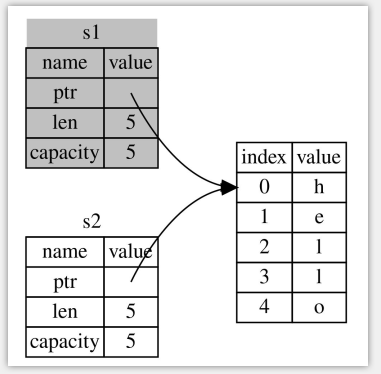

## 第4章  所有权

所有权规则

> - Each value in Rust has a variable that’s called its owner.
>- There can only be one owner at a time.
> - When the owner goes out of scope, the value will be dropped.

- 1.Rust 中的每一个值都有一个被称为其 所有者（owner）的变量。
- 2.值有且只有一个所有者(在同一时间)。
- 3.当所有者（变量）离开作用域，这个值将被丢弃。

https://kaisery.github.io/trpl-zh-cn/ch04-01-what-is-ownership.html


#### Rust变量与数据交互的方式(1): 移动

Rust借鉴了C++11中的右值引用, Rust青出于蓝而胜于蓝.

回顾一下C++11中的右值引用

```cpp
#include <iostream>
#include <vector>
#include <string>
#include <utility>

int main() 
{
    // https://en.cppreference.com/w/cpp/utility/move

    std::string strtmp = "c++ string";
    std::string strnew(std::move(strtmp));
    std::cout << "strtmp:" << strtmp << std::endl; //空
    std::cout << "strnew:" << strnew  << std::endl;

}
```

Rust中的所有权的转移

```rust
fn main() {
    let s1 = String::from("hello");
    let s2 = s1; //此处将 s1 的所有权 移交给了 s2,  s1不再有效
    // println!("s1: {}", s1); //编译报错: value borrowed here after move
    println!("s2: {}", s2);
}
```

`s1` 被移动到了 `s2` 之后, `s1` 不再有效.  也就不存在多次释放的问题




####  Rust变量与数据交互的方式(2): 克隆

即深拷贝

```rust
fn main() {
    let s1 = String::from("hello");
    let s2 = s1.clone();
    println!("s1 = {}, s2 = {}", s1, s2);
}
```


#### Rust变量与数据交互的方式(3):  拷贝栈上的数据
在编译时已知大小的类型被整个存储在栈上，所以拷贝其实际的值是快速的

任何简单标量值的组合可以是 Copy 的，不需要分配内存或某种形式资源的类型是 Copy 的, 如下:

- 所有整数类型，比如 u32。
- 布尔类型，bool，它的值是 true 和 false。
- 所有浮点数类型，比如 f64。
- 字符类型，char。
- 元组，当且仅当其包含的类型也都是 Copy 的时候。比如，(i32, i32) 是 Copy 的，但 (i32, String) 就不是。

```rust

fn main() {

    //整型 数组是Copy的
    let x = 5;
    let y = x; 
    println!("x = {}, y = {}", x, y);


    //仅包含Copy的类型栈上数组是 Copy 的
    let a = [1, 2, 3]; // 栈上数组
    let b = a;
    println!("a = {:?}", a);
    println!("b = {:?}", b);

    // 堆上数组不是 Copy的
    let sa = vec![1, 2, 3]; //堆上数组  Vec<i32> 
    let sb = sa; //moved
    // println!("sa = {:?}", sa);  //ERROR
    println!("sb = {:?}", sb);

    // 包含堆上数据 栈上数组不是 Copy的
    let ss = [vec![1,2,3], vec![4, 5, 6]];
    let ss2 = ss; // moved
    // println!("{:?}", ss);  //ERROR
    println!("{:?}", ss2);

    // 布尔类型  是 Copy的
    let bl: bool = false;
    let cl = bl;
    println!("bl = {}, cl = {}", bl, cl); // OK

    //浮点型 f32 和 f64  是Copy的
    let f: f32 = 0.234f32;
    let f2 = f;
    println!("f = {}, f2 = {}", f, f2); //OK

    //字符型 char  是 Copy的
    let ch = '中';
    let ch2 = ch;
    println!("ch = {}, ch2 = {}", ch, ch2); //OK


    //仅包含 Copy类型的 元组
    let tp = (1, 2.4, '国', true, "good", [1, 2, 3]);
    let tp2  = tp;
    println!("tp = {:?}", tp); // OK
    println!("tp2 = {:?}", tp2); //OK
}
```


#### 所有权与函数

变量的所有权总是遵循相同的模式：将值赋给另一个变量时移动它。当持有堆中数据值的变量离开作用域时，其值将通过 drop 被清理掉，除非数据被移动为另一个变量所有

```rust
fn foo() -> String {
    let s = String::from("hello");
    s   //移出
}

fn back(s: String) -> String {
    println!("back() s = {}", s);
    s
}

fn oof(s: String) {   //获取所有权
    println!("oof() s = {}", s);
}

fn main() {

    let s1 = foo();
    println!("s1 = {}", s1); //OK

    let s2 = back(s1); // s1已经被moved, 

    oof(s2); //moved
    // 此处 s1已经无效

    // println!("s2 = {}", s2); //ERROR
}
```

### 引用与借用

引用(reference): 不获取变量的所有权,仅获取变量的值
- 不可变引用, 可变变量和不可变量都可以有不可变引用
- 可变引用, 只有可变变量才有可变引用

借用(borrowing): 以引用作为函数参数称为借用

引用的规则

- 在任意给定时间，要么 只能有一个可变引用，要么 只能有多个不可变引用。
- 引用必须总是有效的


```rust

fn foo(s: &String) {
    println!("foo() s = {}", s);
    // s.push_str("boy");  // ERROR 不可变引用,不可修改
}

fn oof(s: &mut String) {
    println!("oof() s = {}", s);
    s.push_str("boy"); //OK , 可变引用可以修改
}

fn main() {
    let mut s = String::from("hello");
    foo(&s); //借用

    println!("main() s = {}", s);

    oof(&mut s); //可变
}
```


### 切片(Slice)类型


```rust
let s = String::from("hello world");

let hello: &str = &s[0..5];  // &str类型
let world = &s[6..11]; //
```


```rust
//值接受 &String, 不接收 &str
fn first(s: &String) -> &str{
    &s[0..1]
}

//可以接受 &String , 也可以接受 &str
fn second(s: &str) -> &str {
    &s[0..1]
}

fn main() {
    let s = "hello world";
    let s1 = String::from("hello world");
    // println!("{}", first(&s)); //error
    println!("{}", first(&s1)); //OK

    println!("{}", second(&s)); //OK
    println!("{}", second(&s1)); //OK   &String 会自动转为 &str
    println!("{}", second(&s1[..])); //OK  即 &s1[..]
}
```

其他类型的slice

```rust
fn main() {
    let a = [1, 2, 3, 4];
    println!("{:?}", &a[..]); // OK
    println!("{:?}", &a[2..]); // OK

    let sa = vec![1, 2, 3, 4];
    println!("{:?}", &sa[..]); // OK
    println!("{:?}", &sa[2..]); // OK

    //元组不支持切片
    // let tp = (1, 2, 3, 4);
    // println!("{:?}", &tp[..]); // ERROR 
    // println!("{:?}", &tp[2..]); // ERROR
}
```


> - 首页: [README.md](../README.md)
> - 上一章: [第03章-通用编程概念](./第03章-通用编程概念.md)
> - 下一章: [第05章-结构体](./第05章-结构体.md)