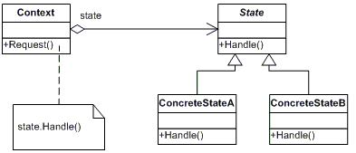

## 第17章 Rust的面向对象编程特性

> 组合优于继承

### 面向对象三大要素

- 封装: Rust可以使用pub与否来封装实现细节
- 继承: Rust可以使用默认的trait方法实现行为共享
- 多态: Rust则通过泛型来对不同的可能类型进行抽象，并通过`trait bounds` 对这些类型所必须提供的内容施加约束

近来继承作为一种语言设计的解决方案在很多语言中失宠了，因为其时常带有共享多于所需的代码的风险。子类不应总是共享其父类的所有特征，但是继承却始终如此。如此会使程序设计更为不灵活，并引入无意义的子类方法调用，或由于方法实际并不适用于子类而造成错误的可能性。某些语言还只允许子类继承一个父类，进一步限制了程序设计的灵活性。

因为这些原因，Rust 选择了一个不同的途径，使用 trait 对象而不是继承。让我们看一下 Rust 中的 trait 对象是如何实现多态的。


### `trait`对象

`trait`对象: 实现了一个特定的`trait`的类型的实例, 以及一个在运行时查找该类型的`trait`方法的表 

有点类似C++中使用虚函数指针(vptr)和虚函数表(vtable)实现多态的机制

以下例子对于理解 trait 对象 很有用

```rust
pub trait Draw {
    fn draw(&self);
}

pub struct Screen {
    pub components: Vec<Box<dyn Draw>>,  // trait对象:它是 Box 中任何实现了 Draw trait 的类型的替身
}

impl Screen {
    //这与定义使用了带有 trait bound 的泛型类型参数的结构体不同。
    //泛型类型参数一次只能替代一个具体类型，而 trait 对象则允许在运行时替代多种具体类型
    pub fn run(&self) {
        for component in self.components.iter() {
            component.draw(); //调用组件的draw方法, 其组件必须是实现了 Draw trait 的 trait对象
        }
    }
}


/*
//使用 泛型类型参数结构体 trait bound
// 这限制了 Screen 实例必须拥有一个全是 Button 类型或者全是 TextField 类型的组件列表
pub struct Screen<T: Draw> {
    pub components: Vec<T>,
}

impl<T> Screen<T>
    where T: Draw {
    pub fn run(&self) {
        for component in self.components.iter() {
            component.draw();
        }
    }
}
*/

pub struct Button {
    pub width: u32,
    pub height: u32,
    pub label: String,
}

impl Draw for Button {
    fn draw(&self) {
        println!("Button draw: {}, {}, {}", self.width, self.height, self.label);
    }
}


struct SelectBox {
    width: u32,
    height: u32,
    options: Vec<String>,
}

impl Draw for SelectBox {
    fn draw(&self) {
        println!("SelectBox draw:{}, {}, {:?}", self.width, self.height, self.options);
    }
}

fn main() {

    let screen = Screen {
        components: vec![
            Box::new(SelectBox{
                width: 89,
                height:90,
                options: vec![
                    String::from("ok"),
                    String::from("this"),
                    String::from("rust"),
                ]
            }),
            Box::new(  {
                width: 50,
                heightButton: 10,
                label: String::from("Ok Button"),
            }),
        ],
    };


    screen.run(); //运行
}

```

当编写库的时候，我们不知道何人会在何时增加 SelectBox 类型，不过 Screen 的实现能够操作并绘制这个新类型，因为 SelectBox 实现了 `Draw trait`，这意味着它实现了 draw 方法。
这个概念 —— 只关心值所反映的信息而不是其具体类型 —— 类似于动态类型语言中称为 鸭子类型（`duck typing`）的概念：如果它走起来像一只鸭子，叫起来像一只鸭子，那么它就是一只鸭子！

在上面的例子中, Screen上的run实现中, run并不需要知道各个组件的具体类型是什么, 它并不检查组件是 Button 或者 SelectBox 的实例。
通过指定 `Box<dyn Draw>` 作为 components vector 中值的类型，我们就可以确定所有组件都实现了 draw方法以供在Screen的run方法被调用.

使用 trait 对象和 Rust 类型系统来进行类似鸭子类型操作的优势是无需在运行时检查一个值是否实现了特定方法或者担心在调用时因为值没有实现方法而产生错误。
如果值没有实现 trait 对象所需的 trait 则 Rust 不会编译这些代码。


#### 动态分发和静态分发:

- 动态分发(dynamic dispatch): 编译器在编译时期无法知道调用了什么方法, 只有在运行时才能确定调用了什么方法的代码.
- 静态分发(static dispatch): 例如泛型的单态化. 编译器在编译时期为每一个被泛型类型参数代替的具体类型生成了非泛型的函数和方法实现. 

trait对象执行动态分发


### `trait`对象安全

Trait对象要求对象安全:

对象安全（object safe）的 trait 才可以组成 trait 对象

如果一个 trait 中所有的方法都符合以下条件, 则trait就是对象安全:
1. 返回值类型不为 Self
2. 方法没有任何泛型类型参数

`Self` 关键字是我们要实现 trait 或方法的类型的别名。对象安全对于 trait 对象是必须的，因为一旦有了 trait 对象，就不再知晓实现该 trait 的具体类型是什么了。如果 trait 方法返回具体的 Self 类型，但是因为 trait 对象不知道其真正的类型，那么编译器不可能推导出此`trait`方法的具体类型。

同理对于泛型类型参数来说，当使用 trait 时其会放入具体的类型参数：此具体类型变成了实现该 trait 的类型的一部分。当使用 trait 对象时其具体类型被抹去了，故无从得知放入泛型参数类型的类型是什么.  (这段话很难理解, 请看下面的例子)

例如:
一个 trait 的方法不是对象安全的例子是标准库中的 Clone trait

```rust
pub trait Clone {
    fn clone(&self) -> Self;
}
```

String 实现了 Clone trait，当在 String 实例上调用 clone 方法时会得到一个 String 实例。类似的，当调用 Vec<T> 实例的 clone 方法会得到一个 Vec<T> 实例。clone 的签名需要知道什么类型会代替 Self，因为这是它的返回值, 而 trait对象不知道。


### Rust实现面向对象设计模式--状态模式(State Pattern)

GoF关于状态模式的定义: 允许一个对象在其内部状态改变时改变它的行为. 对象看起来似乎修改了它的类. 




#### 完全面向对象的方式

```rust
//  Rust 实现 状态模式   (State Pattern)
pub struct Post {
    state: Option<Box<dyn State>>,
    content: String,
}

impl Post {
    pub fn new() -> Post {
        Post {
            state: Some(Box::new(Draft {})),
            content: String::new(),
        }
    }

    pub fn add_text(&mut self, text: &str) {
        self.content.push_str(text);
    }

    pub fn content(&self) -> &str {
        // ""

        // as_ref() 返回  Option<&Box<State>>
        // 如果不调用 as_ref，将会得到一个错误，因为不能将 state 移动出借用的 &self 函数参数。
        self.state.as_ref().unwrap().content(self)
    }

    pub fn request_review(&mut self) {
        if let Some(s) = self.state.take() {
            self.state  = Some(s.request_review());
        }
    }

    pub fn approve(&mut self) {
        if let Some(s) = self.state.take() {
            self.state = Some(s.approve());
        }
    }
}

trait State {
    fn request_review(self: Box<Self>) -> Box<dyn State>;
    fn approve(self: Box<Self>) -> Box<dyn State> ;

    // 如果参数有引用, 就要注意生命周期的声明
    fn content<'a>(&self, _post: &'a Post) -> &'a str {
        ""
    }
}

struct Draft {}

impl State for Draft {
    fn request_review(self: Box<Self>) -> Box<dyn State> {
        Box::new(PendingReview {})
    }


    fn approve(self: Box<Self>) -> Box<dyn State> {
        // Box::new(Published {})
        self
    }

}


struct PendingReview {}

impl State for PendingReview {
    fn request_review(self: Box<Self>) -> Box<dyn State> {
        self
    }

    fn approve(self: Box<Self>) -> Box<dyn State> {
        Box::new(Published {})
    }
}


struct Published {}

impl State for Published {
    fn request_review(self: Box<Self>) -> Box<dyn State> {
        self
    }

    fn approve(self: Box<Self>) -> Box<dyn State> {
        self
    }

    fn content<'a>(&self, post: &'a Post) -> &'a str {
        &post.content
    }
}


fn main() {

    // Draft --request_review()--> PendingReview --approve()--> Published


    let mut post = Post::new();

    post.add_text("I have a apple.");
    post.approve(); //对 Draft 调用 approve 没有任何内容
    post.request_review();
    println!("content: {}", post.content());

    post.request_review();
    println!("content: {}", post.content());


    post.approve();
    println!("content: {}", post.content());
}

```


以上Rust面向对象方式实现的状态模式的缺点:

- 实现了状态之间的转换, 状态之间有依赖关系, 如果在两个状态之间新增一个状态, 就要修改代码.
- 另一个缺点是我们会发现一些重复的逻辑。为了消除他们，可以尝试为 State trait 中返回 self 的 request_review 和 approve 方法增加默认实现，不过这会违反对象安全性，因为 trait 不知道 self 具体是什么。我们希望能够将 State 作为一个 trait 对象，所以需要其方法是对象安全的。
另一个重复是 Post 中 request_review 和 approve 这两个类似的实现。


完全按照面向对象语言的定义实现这个模式并没有尽可能地利用 Rust 的优势


#### 非面向对象方式

```rust

pub struct Post {
    content: String,
}

impl Post {
    pub fn new() -> DraftPost {
        DraftPost {
            content: String::new(),
        }
    }

    pub fn content(&self) -> &str {
        &self.content
    }
}

pub struct DraftPost {
    content: String,
}


impl DraftPost {
    pub fn add_text(&mut self, text: &str) {
        self.content.push_str(text);
    }

    pub fn request_review(self) -> PendingReviewPost {
        PendingReviewPost {
            content: self.content,
        }
    }

}

pub struct PendingReviewPost {
    content: String,
}

impl PendingReviewPost {
    pub fn approve(self) -> Post {
        Post {
            content: self.content,
        }
    }
}

fn main() {

    let mut post = Post::new();
    post.add_text("I have some apples");

    let post = post.request_review();

    let post = post.approve();

    println!("content: {}", post.content());

}
```

在 Rust 中面向对象模式并不总是最好的解决方案，因为 Rust 拥有像所有权这样的面向对象语言所没有的功能。


### 总结
阅读本章后，不管你是否认为 Rust 是一个面向对象语言，现在你都见识了 trait 对象是一个 Rust 中获取部分面向对象功能的方法。动态分发可以通过牺牲少量运行时性能来为你的代码提供一些灵活性。这些灵活性可以用来实现有助于代码可维护性的面向对象模式。Rust 也有像所有权这样不同于面向对象语言的功能。面向对象模式并不总是利用 Rust 优势的最好方式，但也是可用的选项。

 

> - 首页: [README.md](../README.md)
> - 上一章: [第16章-Rust并发编程](./第16章-Rust并发编程.md)
> - 下一章:[第18章-模式匹配](./第18章-模式匹配.md)